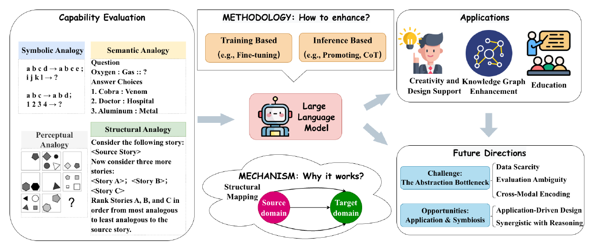
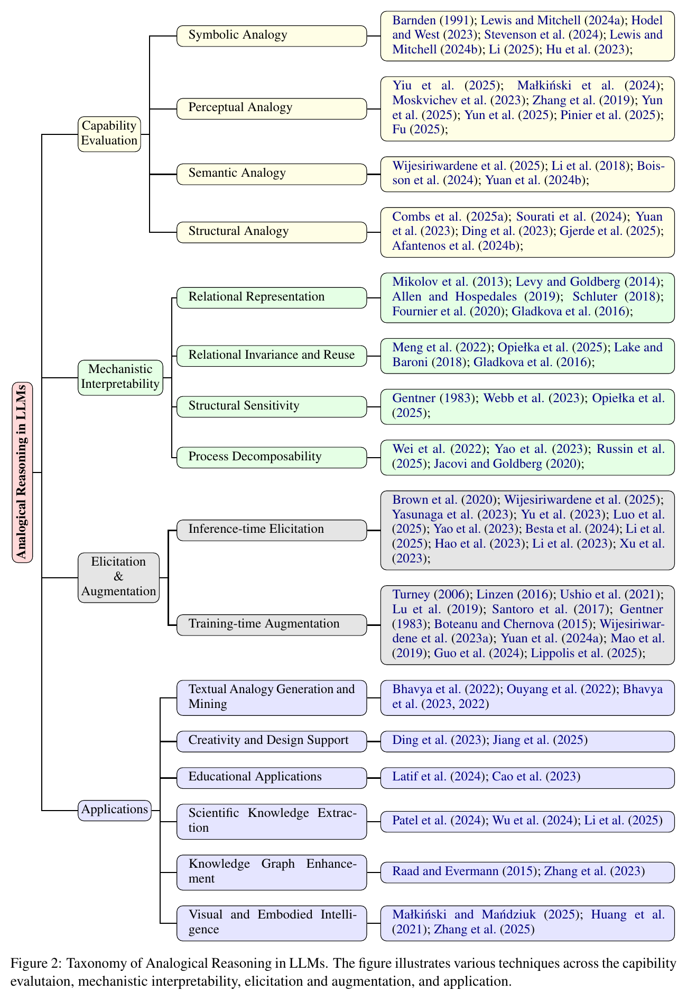
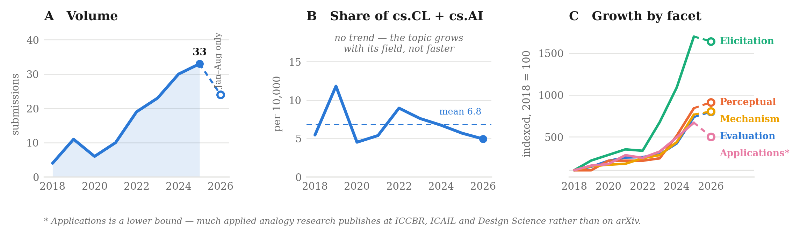

<!-- DO NOT EDIT README.md — it is generated by scripts/build.py.
     Edit templates/README.head.md, templates/README.foot.md, or data/*.yaml. -->

<div align="center">

# LLMs Meet Analogical Reasoning

**Official repository for _Large Language Models Meet Analogical Reasoning: A Systematic Survey and Perspectives_ — with a continuously updated paper list.**

[](https://awesome.re)
[](https://arxiv.org/abs/PLACEHOLDER)
[](CONTRIBUTING.md)
[](https://github.com/Yu-Xiaoyan/LLM-Analogical-Reasoning-Survey/commits/main)
[](https://github.com/Yu-Xiaoyan/LLM-Analogical-Reasoning-Survey/stargazers)

**224** papers · **17** benchmarks · **53** added since the survey · **57** proposed for the next revision

</div>

> Analogy is the fuel and fire of thinking. — Hofstadter & Sander (2013)

Analogical reasoning — mapping relational structure from a familiar source onto
an unfamiliar target — is a stricter test of LLMs than most reasoning
benchmarks. It asks whether a model has genuine relational understanding or is
reapplying memorised patterns. This repository tracks that literature, organised
by the same taxonomy as our survey.

**Five research questions structure the list:**

| | Question | Section |
| --- | --- | --- |
| **RQ1** | What defines analogical reasoning in the context of LLMs? | Definitions & Scope |
| **RQ2** | To what extent do current models demonstrate this capability? | Capability Evaluation |
| **RQ3** | What representational mechanisms underpin these behaviours? | Mechanistic Interpretability |
| **RQ4** | How can these capabilities be elicited and enhanced? | Elicitation & Augmentation |
| **RQ5** | How can analogical reasoning be deployed for real applications? | Applications |

<p align="center">
  
</p>

<details>
<summary><b>Full taxonomy mindmap</b></summary>
<p align="center">
  
</p>
</details>

## How the field is moving

<p align="center">
  
</p>

Measured from arXiv rather than from this list — a curated list would only
measure our own reading. Submissions matching *analogical reasoning* grew about
eightfold since 2018 **(A)**, but cs.CL+cs.AI grew just as fast, so the topic's
share of its parent field is flat **(B)**: this is a steady concern, not a
bandwagon. What did change is where the attention goes **(C)** — indexed to
2018, elicitation and prompting grew ×17.0 against ×6.7–8.4 for every other
facet, while the mechanism facet's share held constant. The field has shifted
from *studying* the capability to *using* it, and mechanistic understanding has
not kept pace.

The applications facet is a floor, not a measurement: applied analogy research
uses its own vocabulary (precedent, case-based reasoning, TRIZ, bio-inspired
design) and publishes at ICCBR, ICAIL and Design Science, none of which arXiv
indexes. Broadening the facet's keywords to cover that vocabulary raised its
2025 count by 13% but moved its growth only from ×6.2 to ×6.7 — the level
shifted, the ranking did not, which is what a roughly time-invariant coverage
bias predicts.

2026 covers January–August only, so its counts are not comparable to a full
year: in **A** and **C** it is drawn as a hollow marker on a dashed segment
rather than as another point on the line. **B** keeps it as a normal point —
numerator and denominator span the same window, so the ratio is unaffected.
Counts are arXiv-only, so ACL-Anthology-only and cognitive-science venues are
undercounted, and facets are keyword proxies scoped to `cs.*`.
Reproduce with `make trends`. Raw counts: [`data/trends.csv`](data/trends.csv).

## Other views

The list below is organised by taxonomy. The same papers, sliced differently:

- [**By year**](docs/by-year.md) — chronological
- [**By tag**](docs/by-tag.md) — `must-read`, `benchmark`, `negative-result`, `multimodal`, …
- [**Taxonomy reference**](docs/taxonomy.md) — what each category means, and where to file a new paper
- [**Benchmarks**](docs/benchmarks.md) — full detail on every evaluation resource

## Citation

If this list or the survey is useful to you, please cite:

```bibtex
@article{yu2026analogical,
  title   = {Large Language Models Meet Analogical Reasoning:
             A Systematic Survey and Perspectives},
  author  = {Yu, Xiaoyan and Ma, Yunshan and Su, Huichen and Sui, Dianbo and
             Chua, Tat-Seng},
  journal = {arXiv preprint arXiv:PLACEHOLDER},
  year    = {2026}
}
```

<!-- BEGIN GENERATED -->

## Contents

- [🔥 New since the survey](#-new-since-the-survey)
- [📌 Proposed for the next revision](#-proposed-for-the-next-revision)
- [Definitions, Scope & Related Surveys (§2)](#definitions-scope-related-surveys-2) — 26 papers
  - [Cognitive Science Foundations](#cognitive-science-foundations) — 16
  - [Scope & Positioning](#scope-positioning) — 3
  - [Related Surveys](#related-surveys) — 7
- [Capability Evaluation (§3)](#capability-evaluation-3) — 89 papers
  - [Symbolic Analogy](#symbolic-analogy) — 15
  - [Perceptual Analogy](#perceptual-analogy) — 23
  - [Semantic Analogy](#semantic-analogy) — 15
  - [Structural Analogy](#structural-analogy) — 11
  - [Common Failure Modes](#common-failure-modes) — 6
  - [Benchmarks & Datasets](#benchmarks-datasets) — 19
- [Mechanistic Interpretability (§4)](#mechanistic-interpretability-4) — 27 papers
  - [Relational Representation](#relational-representation) — 13
  - [Relational Invariance & Reuse](#relational-invariance-reuse) — 5
  - [Structural Sensitivity](#structural-sensitivity) — 2
  - [Process Decomposability](#process-decomposability) — 7
- [Elicitation & Augmentation (§5)](#elicitation-augmentation-5) — 38 papers
  - [Analogical Prompting](#analogical-prompting) — 10
  - [Retrieval & Memory Augmentation](#retrieval-memory-augmentation) — 11
  - [Relational Modeling](#relational-modeling) — 10
  - [Knowledge-Enhanced Methods](#knowledge-enhanced-methods) — 7
- [Applications (§6)](#applications-6) — 44 papers
  - [Textual Analogy Generation & Mining](#textual-analogy-generation-mining) — 7
  - [Creativity & Design Support](#creativity-design-support) — 10
  - [Educational Applications](#educational-applications) — 6
  - [Scientific Knowledge Extraction](#scientific-knowledge-extraction) — 11
  - [Knowledge Graph Enhancement](#knowledge-graph-enhancement) — 3
  - [Visual & Embodied Intelligence](#visual-embodied-intelligence) — 7
- [Benchmarks](#benchmarks)
- [Reported results](#reported-results)
- [Contributing](#contributing)

---

## 🔥 New since the survey

**53** papers published after the survey was finalised (January 2026). They are filed in the taxonomy below like everything else and badged with their date — this is just the dated index.

| | Paper | Filed under |
| --- | --- | --- |
| `2026-08` | [On the Diversity of Analogy Making in Large Language Models](https://arxiv.org/abs/2608.03233) | [Semantic Analogy](#semantic-analogy) |
| `2026-08` | [A Generalized Parallelogram Rule for Proportional Analogies on Riemannian Manifolds](https://arxiv.org/abs/2608.14220) | [Semantic Analogy](#semantic-analogy) |
| `2026-08` | [Proportional Analogies on Probability Distributions via Bayesian Updating](https://arxiv.org/abs/2608.11724) | [Semantic Analogy](#semantic-analogy) |
| `2026-08` | [What Can Artificial Intelligence Learn from Medicine? Generative Analogies and Reliable Machine Learning Systems](https://arxiv.org/abs/2608.18186) | [Scientific Knowledge Extraction](#scientific-knowledge-extraction) |
| `2026-07` | [ADAGE: A Language-Agnostic Pipeline for Analogical Reasoning Evaluation](https://arxiv.org/abs/2607.23058) | [Benchmarks & Datasets](#benchmarks-datasets) |
| `2026-07` | [TraceViT: Grounded Trace Supervision for Visual Abstract Reasoning](https://arxiv.org/abs/2607.29586) | [Perceptual Analogy](#perceptual-analogy) |
| `2026-07` | [Bringing Back Rule Induction to Fluid Intelligence Research? An Initial Validation of the ARC-AGI Benchmark in Humans](https://arxiv.org/abs/2607.11263) | [Perceptual Analogy](#perceptual-analogy) |
| `2026-07` | [Verbalizable Representations Form a Global Workspace in Language Models](https://arxiv.org/abs/2607.15495) | [Process Decomposability](#process-decomposability) |
| `2026-07` | ⭐ [Analogical Deep Research: Retrieving and Integrating Historical Analogies for Foresight Analysis](https://arxiv.org/abs/2607.13602) | [Retrieval & Memory Augmentation](#retrieval-memory-augmentation) |
| `2026-07` | [Metaphor-Induced Algorithmic Steering: Cross-Domain Procedural Transfer in LLM Code Generation](https://arxiv.org/abs/2607.28683) | [Analogical Prompting](#analogical-prompting) |
| `2026-06` | [Structural Grid Descriptors Predict Within-Task Solver Success on ARC-AGI](https://arxiv.org/abs/2606.09026) | [Perceptual Analogy](#perceptual-analogy) |
| `2026-06` | [From numerical proportions to analogical proportions between probabilities](https://arxiv.org/abs/2606.23029) | [Semantic Analogy](#semantic-analogy) |
| `2026-06` | [The Metanym Game: A Self-Contained, Self-Consistent LLM Peer-Community Benchmark for Structural Intelligence](https://arxiv.org/abs/2606.21008) | [Benchmarks & Datasets](#benchmarks-datasets) |
| `2026-06` | ⭐ [Learning to Reason by Analogy via Retrieval-Augmented Reinforcement Fine-Tuning](https://arxiv.org/abs/2606.13680) | [Retrieval & Memory Augmentation](#retrieval-memory-augmentation) |
| `2026-06` | [Enhancing Creativity in 3D Generative Design via a TRIZ-Inspired Text-to-CAD Framework](https://arxiv.org/abs/2606.21378) | [Creativity & Design Support](#creativity-design-support) |
| `2026-05` | [Structural Ranking of the Cognitive Plausibility of Computational Models of Analogy and Metaphors with the Minimal Cognitive Grid](https://arxiv.org/abs/2605.01359) | [Cognitive Science Foundations](#cognitive-science-foundations) |
| `2026-05` | [StemBind: When MLLMs Get Lost Between Rules and Instances in Abstract Visual Reasoning](https://arxiv.org/abs/2606.00148) | [Perceptual Analogy](#perceptual-analogy) |
| `2026-05` | [Uneven Evolution of Cognition Across Generations of Generative AI Models](https://arxiv.org/abs/2605.06815) | [Common Failure Modes](#common-failure-modes) |
| `2026-05` | [Enhancing Agent Safety Judgment: Controlled Benchmark Rewriting and Analogical Reasoning for Deceptive Out-of-Distribution Scenarios](https://arxiv.org/abs/2605.03242) | [Analogical Prompting](#analogical-prompting) |
| `2026-05` | [Compositional Transduction with Latent Analogies for Offline Goal-Conditioned Reinforcement Learning](https://arxiv.org/abs/2605.20609) | [Relational Modeling](#relational-modeling) |
| `2026-05` | ⭐ [Unlocking LLM Creativity in Science through Analogical Reasoning](https://arxiv.org/abs/2605.11258) | [Creativity & Design Support](#creativity-design-support) |
| `2026-05` | [Beyond Nutrition Labels: How Analogical Reasoning Shapes Synthetic Media Disclosure Design](https://arxiv.org/abs/2605.19045) | [Educational Applications](#educational-applications) |
| `2026-05` | [Analogical Trajectory Transfer](https://arxiv.org/abs/2605.14393) | [Visual & Embodied Intelligence](#visual-embodied-intelligence) |
| `2026-05` | [Teaching Through Analogies: A Modular Pipeline for Educational Analogy Generation](https://arxiv.org/abs/2605.24211) | [Educational Applications](#educational-applications) |
| `2026-05` | [IdeaForge: A Knowledge Graph-Grounded Multi-Agent Framework for Cross-Methodology Innovation](https://arxiv.org/abs/2605.13311) | [Creativity & Design Support](#creativity-design-support) |
| `2026-04` | [When Models Know More Than They Say: Probing Analogical Reasoning in LLMs](https://arxiv.org/abs/2604.03877) | [Semantic Analogy](#semantic-analogy) |
| `2026-04` | [Grounding Before Generalizing: How AI Differs from Humans in Causal Transfer](https://arxiv.org/abs/2604.24062) | [Structural Analogy](#structural-analogy) |
| `2026-04` | [DIRCR: Dual-Inference Rule-Contrastive Reasoning for Solving RAVENs](https://arxiv.org/abs/2604.17584) | [Perceptual Analogy](#perceptual-analogy) |
| `2026-04` | [Symbolic Grounding Reveals Representational Bottlenecks in Abstract Visual Reasoning](https://arxiv.org/abs/2604.21346) | [Perceptual Analogy](#perceptual-analogy) |
| `2026-04` | [Multi-modal Reasoning with LLMs for Visual Semantic Arithmetic](https://arxiv.org/abs/2604.19567) | [Perceptual Analogy](#perceptual-analogy) |
| `2026-04` | ⭐ [Transformer See, Transformer Do: Copying as an Intermediate Step in Learning Analogical Reasoning](https://arxiv.org/abs/2604.06501) | [Process Decomposability](#process-decomposability) |
| `2026-04` | [Linear Representations of Hierarchical Concepts in Language Models](https://arxiv.org/abs/2604.07886) | [Relational Invariance & Reuse](#relational-invariance-reuse) |
| `2026-04` | [CARO: Chain-of-Analogy Reasoning Optimization for Robust Content Moderation](https://arxiv.org/abs/2604.10504) | [Analogical Prompting](#analogical-prompting) |
| `2026-04` | [CHAIRO: Contextual Hierarchical Analogical Induction and Reasoning Optimization for LLMs](https://arxiv.org/abs/2604.10502) | [Analogical Prompting](#analogical-prompting) |
| `2026-04` | ⭐ [Reason Analogically via Cross-domain Prior Knowledge: An Empirical Study of Cross-domain Knowledge Transfer for In-Context Learning](https://arxiv.org/abs/2604.05396) | [Retrieval & Memory Augmentation](#retrieval-memory-augmentation) |
| `2026-04` | ⭐ [Analogical Reasoning as a Doctor: A Foundation Model for Gastrointestinal Endoscopy Diagnosis](https://arxiv.org/abs/2604.05649) | [Visual & Embodied Intelligence](#visual-embodied-intelligence) |
| `2026-04` | [ASPECT:Analogical Semantic Policy Execution via Language Conditioned Transfer](https://arxiv.org/abs/2604.08355) | [Visual & Embodied Intelligence](#visual-embodied-intelligence) |
| `2026-04` | [ANVIL: Analogies and Videos for Lecturers](https://arxiv.org/abs/2605.16295) | [Educational Applications](#educational-applications) |
| `2026-04` | [GraphWalker: Patient Analogy Meets Information Gain for Clinical Reasoning with Large Language Models](https://arxiv.org/abs/2604.06684) | [Scientific Knowledge Extraction](#scientific-knowledge-extraction) |
| `2026-03` | ⭐ [CARV: A Diagnostic Benchmark for Compositional Analogical Reasoning in Multimodal LLMs](https://arxiv.org/abs/2603.27958) | [Perceptual Analogy](#perceptual-analogy) |
| `2026-03` | [FrameNet Semantic Role Classification by Analogy](https://arxiv.org/abs/2603.19825) | [Semantic Analogy](#semantic-analogy) |
| `2026-03` | [Learning Like Humans: Analogical Concept Learning for Generalized Category Discovery](https://arxiv.org/abs/2603.19918) | [Perceptual Analogy](#perceptual-analogy) |
| `2026-03` | ⭐ [Feature Resemblance: Towards a Theoretical Understanding of Analogical Reasoning in Transformers](https://arxiv.org/abs/2603.05143) | [Relational Representation](#relational-representation) |
| `2026-03` | ⭐ [Large Language Models provide support for the parallelogram theory of analogy](https://arxiv.org/abs/2603.19066) | [Relational Representation](#relational-representation) |
| `2026-03` | ⭐ [Enhancing Structural Mapping with LLM-derived Abstractions for Analogical Reasoning in Narratives](https://arxiv.org/abs/2603.29997) | [Knowledge-Enhanced Methods](#knowledge-enhanced-methods) |
| `2026-03` | [Structural Abstraction as an Inductive Bias for Non-Stationary Language Model Training](https://arxiv.org/abs/2603.17198) | [Relational Modeling](#relational-modeling) |
| `2026-02` | [Spanning the Visual Analogy Space with a Weight Basis of LoRAs](https://arxiv.org/abs/2602.15727) | [Perceptual Analogy](#perceptual-analogy) |
| `2026-02` | [VIRAL: Visual In-Context Reasoning via Analogy in Diffusion Transformers](https://arxiv.org/abs/2602.03210) | [Perceptual Analogy](#perceptual-analogy) |
| `2026-02` | ⭐ [Emergent Analogical Reasoning in Transformers](https://arxiv.org/abs/2602.01992) | [Relational Representation](#relational-representation) |
| `2026-02` | [Beyond Input-Output: Rethinking Creativity through Design-by-Analogy in Human-AI Collaboration](https://arxiv.org/abs/2602.09423) | [Creativity & Design Support](#creativity-design-support) |
| `2026-01` | [MasalBench: A Benchmark for Contextual and Cross-Cultural Understanding of Persian Proverbs in LLMs](https://arxiv.org/abs/2601.22050) | [Benchmarks & Datasets](#benchmarks-datasets) |
| `2026-01` | [Relational Knowledge Distillation Using Fine-tuned Function Vectors](https://arxiv.org/abs/2601.08169) | [Relational Invariance & Reuse](#relational-invariance-reuse) |
| `2026-01` | [Routing by Analogy: kNN-Augmented Expert Assignment for Mixture-of-Experts](https://arxiv.org/abs/2601.02144) | [Retrieval & Memory Augmentation](#retrieval-memory-augmentation) |

---

## 📌 Proposed for the next revision

Papers that belong in the survey but are not cited in v1 — **57** of them, from a coverage audit against the taxonomy. Unlike the feed above, these are not simply newer than the survey; they were missed. `P1` should be added, `P2` is worth adding, `P3` is optional.

### P1 — 22

| Paper | Goes in | Why it changes the survey |
| --- | --- | --- |
| [Analogical Problem Solving](https://doi.org/10.1016/0010-0285(80)90013-4)<br><sub>Mary L. Gick and Keith J. Holyoak · 1980</sub> | Definitions, Scope & Related Surveys | The survey uses human performance as its benchmark throughout but cites no human transfer experiment; this is the canonical one. |
| [Schema Induction and Analogical Transfer](https://doi.org/10.1016/0010-0285(83)90002-6)<br><sub>Mary L. Gick and Keith J. Holyoak · 1983</sub> | Definitions, Scope & Related Surveys | Comparing two source analogues induces a reusable schema — the human result that in-context learning with multiple exemplars mirrors. |
| [The Structure-Mapping Engine: Algorithm and Examples](https://doi.org/10.1016/0004-3702(89)90077-5)<br><sub>Brian Falkenhainer, Kenneth D. Forbus and Dedre Gentner · 1989</sub> | Definitions, Scope & Related Surveys | §2.1 writes structure-mapping as an algorithm-shaped constraint and cites only Gentner (1983); this is the algorithm that constraint came from. |
| [The (Too Many) Problems of Analogical Reasoning with Word Vectors](https://aclanthology.org/S17-1017/)<br><sub>Anna Rogers, Aleksandr Drozd and Bofang Li · 2017</sub> | Capability Evaluation | The most-cited statement of the vector-offset critique; §3.5 and §4.1 cite Linzen, Schluter and Fournier but skip it. |
| [SOLVENT: A Mixed-Initiative System for Finding Analogies between Research Papers](https://doi.org/10.1145/3274300)<br><sub>Joel Chan et al. · 2018</sub> | Applications | Directly implements what §7.2.2 proposes as an opportunity — indexing papers by purpose and mechanism to retrieve cross-domain analogues. |
| [Distilling Relation Embeddings from Pretrained Language Models](https://aclanthology.org/2021.emnlp-main.712/)<br><sub>Asahi Ushio, Jose Camacho-Collados and Steven Schockaert · 2021</sub> | Elicitation & Augmentation | RelBERT is the central implementation of §5.2's "elevate relations to first-class units", and the survey cites only the same authors' analogy evaluation paper. |
| [In-context Learning and Induction Heads](https://arxiv.org/abs/2209.11895)<br><sub>Catherine Olsson et al. · 2022</sub> | Mechanistic Interpretability | The mechanism §4.4 needs, and the prerequisite for the 2026 finding that analogical behaviour is scaffolded on a copying circuit. |
| [Comparing Humans, GPT-4, and GPT-4V on Abstraction and Reasoning Tasks](https://arxiv.org/abs/2311.09247)<br><sub>Melanie Mitchell, Alessandro B. Palmarini and Arseny Moskvichev · 2023</sub> | Capability Evaluation | The survey cites ConceptARC but not the headline evaluation its own authors ran on it — including the finding that the multimodal model does worse than the text-only one. |
| [In-Context Learning Creates Task Vectors](https://arxiv.org/abs/2310.15916)<br><sub>Roee Hendel, Mor Geva and Amir Globerson · 2023</sub> | Mechanistic Interpretability | Independent, contemporaneous confirmation of the same mechanism; citing both is what makes the finding safe to build on. |
| [Analogical Reasoning, Generalization, and Rule Learning for Common Law Reasoning](https://dl.acm.org/doi/10.1145/3594536.3595121)<br><sub>Joseph Blass and Kenneth D. Forbus · 2023</sub> | Applications | §7.2.1 proposes jurisprudence as a future vertical for analogical reasoning, but AI & Law has modelled case-based analogy for three decades. The opportunity should be framed against that work, not as untouched ground. |
| [Function Vectors in Large Language Models](https://arxiv.org/abs/2310.15213)<br><sub>Eric Todd et al. · 2024</sub> | Mechanistic Interpretability | §4.1 asks whether the mapped relation admits an explicit, localisable representation. This answers yes, causally, and the survey does not cite it. |
| [Evidence from Counterfactual Tasks Supports Emergent Analogical Reasoning in Large Language Models](https://arxiv.org/abs/2404.13070)<br><sub>Taylor Webb, Keith J. Holyoak and Hongjing Lu · 2025</sub> | Capability Evaluation | §3.1 stages the emergence debate as claim-then-rebuttal and stops there. This is the authors' reply, and it moves the conclusion from "the ability is illusory" to "it is sensitive to the execution medium". |
| [VOILA: Evaluation of MLLMs for Perceptual Understanding and Analogical Reasoning](https://arxiv.org/abs/2503.00043)<br><sub>Nilay Yilmaz et al. · 2025</sub> | Capability Evaluation | Missing from Table 1 despite predating the survey. It is the strongest perceptual-analogy counter-evidence because it requires generating the completion rather than selecting it, closing the multiple-choice shortcut. |
| [I-RAVEN-X: Benchmarking Generalization and Robustness of Analogical and Mathematical Reasoning in Large Language and Reasoning Models](https://arxiv.org/abs/2510.17496)<br><sub>Giacomo Camposampiero et al. · 2025</sub> | Capability Evaluation | I-RAVEN-X stress-tests generalisation and robustness on the RPM family the survey leans on in §3.2, and reports where those benchmarks stop discriminating. |
| [Modeling Understanding of Story-Based Analogies Using Large Language Models](https://arxiv.org/abs/2507.10957)<br><sub>Kalit Inani et al. · 2025</sub> | Capability Evaluation | Story-analogy comprehension modelled directly; §3.4 argues about narrative mapping while citing mostly identification benchmarks. |
| [On the Emergence of Linear Analogies in Word Embeddings](https://arxiv.org/abs/2505.18651)<br><sub>Daniel J. Korchinski et al. · 2025</sub> | Mechanistic Interpretability | Explains *why* linear analogy structure emerges in embeddings at all — the theoretical complement to §4.1's empirical account, which currently stops at Allen & Hospedales (2019). |
| [Analogical Reasoning with Large Language Models: A Co-Creative Framework and Benchmarking of LLMs in Design Ideation](https://www.cambridge.org/core/journals/design-science/article/analogical-reasoning-with-large-language-models-a-cocreative-framework-and-benchmarking-of-llms-in-design-ideation/0B8149CCF53C45E1E1B78C4CA93E5BDC)<br><sub>Rutvik Kokate and Prasad Onkar · 2025</sub> | Applications | Benchmarks LLMs specifically on generating analogical stimuli for designers and measures the effect on idea quality — the applied evaluation §6's creativity subsection asserts but never cites. |
| [Review of Case-Based Reasoning for LLM Agents: Theoretical Foundations, Architectural Components, and Cognitive Integration](https://arxiv.org/abs/2504.06943)<br><sub>Kostas Hatalis, Despina Christou and Vyshnavi Kondapalli · 2025</sub> | Applications | Case-based reasoning is analogical reasoning under another name, with its own conference (ICCBR) and thirty years of results. The survey never mentions it, which leaves §5.1's retrieval discussion detached from the field that formalised case retrieval and adaptation. |
| [LacMaterial: Large Language Models as Analogical Chemists for Materials Discovery](https://arxiv.org/abs/2510.22312)<br><sub>Hongyu Guo · 2025</sub> | Applications | LLMs as analogical reasoners for materials discovery — a worked scientific-discovery application of the kind §6 asserts but thinly evidences. |
| [Analogy-Driven Financial Chain-of-Thought (AD-FCoT): A Prompting Approach for Financial Sentiment Analysis](https://arxiv.org/abs/2509.12611)<br><sub>Anmol Singhal Navya Singhal · 2025</sub> | Applications | §7.2.1 names financial analysis as a target vertical for analogical reasoning; this is that application, already built and evaluated. |
| [Unlocking Scientific Concepts: How Effective Are LLM-Generated Analogies for Student Understanding and Classroom Practice?](https://arxiv.org/abs/2502.16895)<br><sub>Zekai Shao et al. · 2025</sub> | Applications | Measures whether LLM-generated analogies actually improve student understanding — the outcome evidence §6's education subsection is missing. |
| [The Curious Case of Analogies: Investigating Analogical Reasoning in Large Language Models](https://arxiv.org/abs/2511.20344)<br><sub>Taewhoo Lee, Minju Song, Chanwoong Yoon, Jungwoo Park and Jaewoo Kang · 2026</sub> | Mechanistic Interpretability | Answers all four of §4's guiding questions at once — where relational information lives, whether it transfers, and whether structural alignment distinguishes success from failure. Published November 2025, before the survey was finalised, and missed by it. |

### P2 — 29

| Paper | Goes in | Why it changes the survey |
| --- | --- | --- |
| [Analogical Mapping by Constraint Satisfaction](https://doi.org/10.1207/s15516709cog1303_1)<br><sub>Keith J. Holyoak and Paul Thagard · 1989</sub> | Definitions, Scope & Related Surveys | The constraint-satisfaction rival to SME; the historical precedent for §5.2's neuro-symbolic framing. |
| [MAC/FAC: A Model of Similarity-Based Retrieval](https://doi.org/10.1207/s15516709cog1902_1)<br><sub>Kenneth D. Forbus, Dedre Gentner and Keith Law · 1995</sub> | Elicitation & Augmentation | §7.2.2 proposes structure-aware retrieval as future work; this is the original two-stage cheap-then-structural retrieval model, from 1995. |
| [Distributed Representations of Structure: A Theory of Analogical Access and Mapping](https://doi.org/10.1037/0033-295X.104.3.427)<br><sub>John E. Hummel and Keith J. Holyoak · 1997</sub> | Definitions, Scope & Related Surveys | §6 currently refers to "the LISA model" through Raad & Evermann (2015) without citing LISA itself — a second-hand citation worth fixing. |
| [Computational Models of Analogy](https://doi.org/10.1002/wcs.105)<br><sub>Dedre Gentner and Kenneth D. Forbus · 2011</sub> | Definitions, Scope & Related Surveys | One citation covering SME, ACME, LISA and MAC/FAC, if there is no room to cite them individually. |
| [Word Embeddings, Analogies, and Machine Learning: Beyond King - Man + Woman = Queen](https://aclanthology.org/C16-1332/)<br><sub>Aleksandr Drozd, Anna Gladkova and Satoshi Matsuoka · 2016</sub> | Capability Evaluation | The constructive half of the critique — 3CosAvg and LRCos partly answer the similarity dependence, so citing only the critique overstates how unsolved it is. |
| [Bongard-LOGO: A New Benchmark for Human-Level Concept Learning and Reasoning](https://arxiv.org/abs/2010.00763)<br><sub>Weili Nie et al. · 2020</sub> | Capability Evaluation | §3.2 cites an MLLM evaluation on Bongard problems without citing the dataset that evaluation runs on. |
| [Emergent Symbols through Binding in a Neural Network](https://arxiv.org/abs/2012.07172)<br><sub>Taylor Webb, Ishan Sinha and Jonathan D. Cohen · 2021</sub> | Mechanistic Interpretability | Webb was building abstract-rule architectures before the LLM claim; this is where the 2023 position comes from, and it grounds §4.2. |
| [Neural Analogical Matching](https://arxiv.org/abs/2004.03573)<br><sub>Maxwell Crouse et al. · 2021</sub> | Mechanistic Interpretability | A neural implementation of SME — the bridge between §4's representational questions and §5.2's neuro-symbolic methods. |
| [Data-Driven Design-by-Analogy: State of the Art and Future Directions](https://arxiv.org/abs/2106.01592)<br><sub>Shuo Jiang, Jianxi Luo et al. · 2021</sub> | Applications | §6's creativity and design subsection has only two entries; this is the field's own review and the anchor that subsection is missing. |
| [Augmenting Scientific Creativity with Retrieval across Knowledge Domains](https://arxiv.org/abs/2206.01328)<br><sub>Hyeonsu B. Kang et al. · 2022</sub> | Applications | User-study evidence that cross-domain analogical retrieval changes what researchers produce — §6 currently argues utility without such evidence. |
| [Solving Hard Analogy Questions with Relation Embedding Chains](https://arxiv.org/abs/2310.12379)<br><sub>Nitesh Kumar and Steven Schockaert · 2023</sub> | Elicitation & Augmentation | Composes relations into chains to reach far-domain pairs — a concrete method for the far-analogy failures documented in §3.4. |
| [Do Large Language Models Solve ARC Visual Analogies Like People Do?](https://arxiv.org/abs/2403.09734)<br><sub>Gustaw Opiełka et al. · 2024</sub> | Capability Evaluation | Direct human-vs-model error analysis on ARC; the prequel to Opiełka et al. (2025), which the survey already cites twice. |
| [Types of Relations: Defining Analogies with Category Theory](https://arxiv.org/abs/2505.19792)<br><sub>Claire Ott · 2025</sub> | Definitions, Scope & Related Surveys | Defines analogy through category theory, which is the same formal move Minegishi et al. (2026) make mechanistically — citing both connects the theory to the mechanism. |
| [Generalizing Analogical Inference from Boolean to Continuous Domains](https://arxiv.org/abs/2511.10416)<br><sub>Francisco Cunha et al. · 2025</sub> | Definitions, Scope & Related Surveys | Extends analogical proportion from Boolean to continuous domains, generalising the formal machinery §2.1 introduces. |
| [ARC-AGI-2: A New Challenge for Frontier AI Reasoning Systems](https://arxiv.org/abs/2505.11831)<br><sub>François Chollet et al. · 2025</sub> | Capability Evaluation | The survey anchors on Chollet (2019) for what ARC measures; the benchmark has since been recalibrated, and any current SOTA claim needs v2. |
| [Is analogy enough to draw novel adjective-noun inferences?](https://arxiv.org/abs/2503.24293)<br><sub>Hayley Ross et al. · 2025</sub> | Capability Evaluation | Asks whether analogy alone supports novel adjective-noun inference — a sharp negative probe for the semantic category. |
| [Analogical Structure, Minimal Contextual Cues and Contrastive Distractors: Input Design for Sample-Efficient Linguistic Rule Induction](https://arxiv.org/abs/2511.10441)<br><sub>Chunyang Jiang · 2025</sub> | Capability Evaluation | Isolates how contextual cues and contrastive distractors shape analogy performance, which is the experimental design question behind §3.5's shortcut findings. |
| [Multilingual LLMs Are Not Multilingual Thinkers: Evidence from Hindi Analogy Evaluation](https://arxiv.org/abs/2507.13238)<br><sub>Ashray Gupta et al. · 2025</sub> | Capability Evaluation | Hindi analogy evaluation showing multilingual models do not transfer analogical ability across languages — the survey is English-only throughout. |
| [GIFARC: Synthetic Dataset for Leveraging Human-Intuitive Analogies to Elevate AI Reasoning](https://arxiv.org/abs/2505.20672)<br><sub>Woochang Sim et al. · 2025</sub> | Capability Evaluation | GIFARC builds ARC-style tasks from human-intuitive analogies, addressing the ARC-is-not-analogy objection directly. |
| [Which Attention Heads Matter for In-Context Learning?](https://arxiv.org/abs/2502.14010)<br><sub>Kayo Yin and Jacob Steinhardt · 2025</sub> | Mechanistic Interpretability | Separates induction heads from function-vector heads and finds the former often mature into the latter — a developmental account that §4 can use. |
| [RelBERT: Embedding Relations with Language Models](https://arxiv.org/abs/2310.00299)<br><sub>Asahi Ushio, Jose Camacho-Collados and Steven Schockaert · 2025</sub> | Elicitation & Augmentation | Journal extension with cross-relation-type generalisation evidence. |
| [MetaLadder: Ascending Mathematical Solution Quality via Analogical-Problem Reasoning Transfer](https://arxiv.org/abs/2503.14891)<br><sub>Honglin Lin et al. · 2025</sub> | Elicitation & Augmentation | MetaLadder conditions mathematical solutions on analogous problems — analogical prompting evaluated on a verifiable task rather than on analogy benchmarks. |
| [AnRe: Analogical Replay for Temporal Knowledge Graph Forecasting](https://aclanthology.org/2025.acl-long.231/)<br><sub>Guo Tang et al. · 2025</sub> | Applications | §6's knowledge-graph subsection has two entries and stops at 2023; this is directly relevant 2025 work. |
| [Legal Rule Induction: Towards Generalizable Principle Discovery from Analogous Judicial Precedents](https://arxiv.org/abs/2505.14104)<br><sub>Wei Fan et al. · 2025</sub> | Applications | LLM-era analogical reasoning over precedent — the concrete form the §7.2.1 jurisprudence proposal already takes in the literature. |
| [BioSpark: Beyond Analogical Inspiration to LLM-augmented Transfer](https://arxiv.org/abs/2503.09838)<br><sub>Hyeonsu Kang et al. · 2025</sub> | Applications | Bio-inspired design as analogical transfer rather than mere inspiration — the design-side counterpart to the structure-mapping framing in §2. |
| [MAGIK: Mapping to Analogous Goals via Imagination-enabled Knowledge Transfer](https://arxiv.org/abs/2506.01623)<br><sub>Ajsal Shereef Palattuparambil et al. · 2025</sub> | Applications | Goal transfer by analogical mapping in embodied RL, the concrete form of the transfer claim in §6. |
| [AR-VRM: Imitating Human Motions for Visual Robot Manipulation with Analogical Reasoning](https://arxiv.org/abs/2508.07626)<br><sub>Dejie Yang et al. · 2025</sub> | Applications | Robot manipulation by analogy to human motion; extends §6's embodied line beyond navigation. |
| [Can LLMs Help Improve Analogical Reasoning For Strategic Decisions? Experimental Evidence from Humans and GPT-4](https://arxiv.org/abs/2505.00603)<br><sub>Phanish Puranam et al. · 2025</sub> | Applications | Experimental evidence on whether LLMs improve human analogical reasoning in strategic decisions — human-in-the-loop evaluation the survey lacks. |
| [Emergent Structured Representations Support Flexible In-Context Inference in Large Language Models](https://arxiv.org/abs/2602.07794)<br><sub>Ningyu Xu et al. · 2026</sub> | Mechanistic Interpretability | Pairs with Minegishi et al. (2026) as the second independent mechanistic result of the year; together they are enough to rewrite §4.2. |

### P3 — 6

| Paper | Goes in | Why it changes the survey |
| --- | --- | --- |
| [Analogy-Making as Perception: A Computer Model](https://doi.org/10.7551/mitpress/1251.001.0001)<br><sub>Melanie Mitchell · 1993</sub> | Definitions, Scope & Related Surveys | Copycat. Shows that Mitchell's critiques in §3.1–3.2 rest on thirty years of building analogy systems, not on a reaction to LLMs. |
| [The Latent Relation Mapping Engine: Algorithm and Experiments](https://arxiv.org/abs/0812.4446)<br><sub>Peter D. Turney · 2008</sub> | Elicitation & Augmentation | The survey cites Turney (2006) on relational similarity; this is the mapping engine built from it, and the corpus-based counterpart to SME. |
| [Bongard-HOI: Benchmarking Few-Shot Visual Reasoning for Human-Object Interactions](https://arxiv.org/abs/2205.13803)<br><sub>Huaizu Jiang et al. · 2022</sub> | Capability Evaluation | Extends the Bongard paradigm to natural images, bridging §3.2 and the embodied applications in §6. |
| [A Benchmark for Compositional Visual Reasoning](https://arxiv.org/abs/2206.05379)<br><sub>Aimen Zerroug et al. · 2022</sub> | Capability Evaluation | Measures sample efficiency and rule transfer, which is what §3.5's "fragile rule generalisation" claim needs to be quantitative. |
| [Development and Evaluation of a Retrieval-Augmented Generation Tool for Creating SAPPhIRE Models of Artificial Systems](https://arxiv.org/abs/2406.19493)<br><sub>Anubhab Majumder, Kausik Bhattacharya and Amaresh Chakrabarti · 2024</sub> | Applications | Builds the structured function representation that design-by-analogy retrieval indexes on — the engineering analogue of §7.2.2's proposal. |
| [Generating Case-Based Legal Arguments with LLMs](https://dl.acm.org/doi/10.1145/3709025.3712216)<br><sub>Morgan A. Gray, Li Zhang and Kevin Ashley · 2025</sub> | Applications | Argument generation by analogy to precedent; complements the rule-induction line above. |

---

## Definitions, Scope & Related Surveys (§2)

> What analogical reasoning is, the cognitive-science theory it inherits (structure-mapping), where it sits relative to deductive/inductive reasoning, and the surveys that neighbour this one.

### Cognitive Science Foundations

_Structure-mapping theory and the classical account of analogy._

- ⭐ **The Structure-Mapping Engine: Algorithm and Examples** `PROPOSED · P1`  
  *Brian Falkenhainer, Kenneth D. Forbus and Dedre Gentner* — Artificial Intelligence 1989 · [paper](https://doi.org/10.1016/0004-3702(89)90077-5)  
  > Turns structure-mapping theory into a working matcher — the reference implementation every later computational account is measured against.

- ⭐ **Structure-Mapping: A Theoretical Framework for Analogy**  
  *Dedre Gentner* — Cognitive Science 1983 · [paper](https://doi.org/10.1016/b978-1-4832-1446-7.50026-1)  
  > The foundational account: analogy aligns two domains by a one-to-one object mapping that preserves relations, and the systematicity principle says we prefer mappings that carry interconnected higher-order structure (causal chains) over isolated shared attributes.

- ⭐ **Analogical Problem Solving** `PROPOSED · P1`  
  *Mary L. Gick and Keith J. Holyoak* — Cognitive Psychology 1980 · [paper](https://doi.org/10.1016/0010-0285(80)90013-4)  
  > The radiation/fortress studies — only 10% of people spontaneously transfer the analogous solution, rising to 75–92% once told the story is relevant. The human baseline for far analogy is far worse than usually assumed.

- **Structural Ranking of the Cognitive Plausibility of Computational Models of Analogy and Metaphors with the Minimal Cognitive Grid** `🔥 2026-05`  
  *Alessio Donvito* — arXiv 2026 · [paper](https://arxiv.org/abs/2605.01359)

- **Generalizing Analogical Inference from Boolean to Continuous Domains** `PROPOSED · P2`  
  *Francisco Cunha et al.* — arXiv 2025 · [paper](https://arxiv.org/abs/2511.10416)

- **Types of Relations: Defining Analogies with Category Theory** `PROPOSED · P2`  
  *Claire Ott* — arXiv 2025 · [paper](https://arxiv.org/abs/2505.19792)

- **Analogy Between Concepts**  
  *Nelly Barbot, Laurent Miclet and Henri Prade* — Artificial Intelligence 2019 · [paper](https://doi.org/10.1016/j.artint.2019.06.008)

- **Surfaces and Essences: Analogy as the Fuel and Fire of Thinking**  
  *Douglas Hofstadter and Emmanuel Sander* — Basic Books 2013 · [search](https://www.semanticscholar.org/search?q=Surfaces+and+Essences%3A+Analogy+as+the+Fuel+and+Fire+of+Thinking)

- **Computational Models of Analogy** `PROPOSED · P2`  
  *Dedre Gentner and Kenneth D. Forbus* — WIREs Cognitive Science 2011 · [paper](https://doi.org/10.1002/wcs.105)

- **Analogy as the Core of Cognition**  
  *Douglas R. Hofstadter* — The Analogical Mind 2001 · [search](https://www.semanticscholar.org/search?q=Analogy+as+the+Core+of+Cognition)

- **Distributed Representations of Structure: A Theory of Analogical Access and Mapping** `PROPOSED · P2`  
  *John E. Hummel and Keith J. Holyoak* — Psychological Review 1997 · [paper](https://doi.org/10.1037/0033-295X.104.3.427)

- **Analogy-Making as Perception: A Computer Model** `PROPOSED · P3`  
  *Melanie Mitchell* — MIT Press 1993 · [paper](https://doi.org/10.7551/mitpress/1251.001.0001)

- **Analogical Learning**  
  *Dedre Gentner* — Similarity and Analogical Reasoning 1989 · [search](https://www.semanticscholar.org/search?q=Analogical+Learning)

- **Analogical Mapping by Constraint Satisfaction** `PROPOSED · P2`  
  *Keith J. Holyoak and Paul Thagard* — Cognitive Science 1989 · [paper](https://doi.org/10.1207/s15516709cog1303_1)

- **Connectionism and Cognitive Architecture: A Critical Analysis**  
  *Jerry A. Fodor and Zenon W. Pylyshyn* — Cognition 1988 · [paper](https://doi.org/10.7551/mitpress/2103.003.0002)

- **Schema Induction and Analogical Transfer** `PROPOSED · P1`  
  *Mary L. Gick and Keith J. Holyoak* — Cognitive Psychology 1983 · [paper](https://doi.org/10.1016/0010-0285(83)90002-6)

### Scope & Positioning

_Work that frames analogy relative to other reasoning modes._

- ⭐ **On the Measure of Intelligence**  
  *François Chollet* — arXiv 2019 · [paper](https://arxiv.org/abs/1911.01547)  
  > Defines intelligence as skill-acquisition efficiency rather than skill itself, and introduces ARC — the reason abstraction-and-analogy benchmarks became the standard stress test for "fluid" intelligence in AI.

- **Compositionality Decomposed: How Do Neural Networks Generalise?**  
  *Dieuwke Hupkes et al.* — JAIR 2020 · [paper](https://doi.org/10.1613/jair.1.11674)

- **Learning Analogies and Semantic Relations**  
  *Peter D. Turney and Michael L. Littman* — arXiv 2003 · [paper](https://arxiv.org/abs/cs/0307055)

### Related Surveys

_Adjacent surveys on LLM reasoning, abstract visual reasoning, and analogy._

- ⭐ **Modelling Analogies and Analogical Reasoning: Connecting Cognitive Science Theory and NLP Research**  
  *Molly R. Petersen, Claire E. Stevenson and Lonneke van der Plas* — TACL 2026 · [paper](https://aclanthology.org/2026.tacl-1.32/)  
  > The closest neighbour to this survey — surveys analogy from the cognitive science side and maps those theories onto NLP tasks. Complementary rather than overlapping: it is theory-first, this survey is LLM-first. (Cited as the 2025 preprint in the survey; now published in TACL 2026.)

- **A Survey of Frontiers in LLM Reasoning: Inference Scaling, Learning to Reason, and Agentic Systems**  
  *Zixuan Ke et al.* — arXiv 2025 · [paper](https://arxiv.org/abs/2504.09037)

- **Deep Learning Methods for Abstract Visual Reasoning: A Survey on Raven's Progressive Matrices**  
  *Mikołaj Małkiński and Jacek Mańdziuk* — ACM Computing Surveys 2025 · [paper](https://doi.org/10.1145/3715093)

- **Logical Reasoning in Large Language Models: A Survey**  
  *Hanmeng Liu et al.* — arXiv 2025 · [paper](https://arxiv.org/abs/2502.09100)

- **Towards Large Reasoning Models: A Survey of Reinforced Reasoning with Large Language Models**  
  *Fengli Xu et al.* — arXiv 2025 · [paper](https://arxiv.org/abs/2501.09686)

- **A Survey on In-Context Learning**  
  *Qingxiu Dong et al.* — EMNLP 2024 · [paper](https://arxiv.org/abs/2301.00234)

- **Towards Reasoning in Large Language Models: A Survey**  
  *Jie Huang and Kevin Chen-Chuan Chang* — ACL Findings 2023 · [paper](https://aclanthology.org/2023.findings-acl.67/)

## Capability Evaluation (§3)

> How well do models actually do it? Organised by level of abstraction and modality, from formal rule manipulation to deep relational understanding.

### Task Difficulty Overview

How the four categories scale in difficulty, and which structural property makes each hard. Stars are an editorial judgement about structural demand, not a measured score — no metric compares across these categories, which is itself part of the problem.

| Task type | Description | Difficulty | Why difficult (structural property) | Dominant failure modes | Evidence |
| --- | --- | --- | --- | --- | --- |
| **[Symbolic](#symbolic-analogy)**<br><sub>15 papers</sub> | Formal rule induction — letter-string sequences, arithmetic matrices. | ★★☆☆☆ | Requires exact rule induction while isolating semantic prior knowledge. | Fragile rule generalisation | [Hodel 2023](https://arxiv.org/abs/2308.16118), [Lewis 2024](https://arxiv.org/abs/2411.14215), [Li 2025](https://arxiv.org/abs/2510.03127) |
| **[Perceptual](#perceptual-analogy)**<br><sub>23 papers</sub> | Pattern recognition from visual stimuli — RAVEN, ARC, Bongard. | ★★★☆☆ | Requires compositional generalisation and decoupling logic from visual noise. | Surface shortcuts · Input–output inconsistency | [Moskvichev 2023](https://arxiv.org/abs/2305.07141), [Yiu 2025](https://arxiv.org/abs/2407.17773), [Yilmaz 2025](https://arxiv.org/abs/2503.00043), [Du 2026](https://arxiv.org/abs/2603.27958) |
| **[Semantic](#semantic-analogy)**<br><sub>15 papers</sub> | Relational mapping between linguistic concepts — proportional analogies, metaphor. | ★★★★☆ | Requires relational preservation across semantically distant domains. | Surface shortcuts | [Boisson 2024](https://aclanthology.org/2024.conll-1.28/), [Wijesiriwardene 2025](https://arxiv.org/abs/2412.00869), [Xu 2026](https://arxiv.org/abs/2604.19567) |
| **[Structural](#structural-analogy)**<br><sub>11 papers</sub> | Systematic mapping of causal and narrative structure across domains. | ★★★★★ | Requires higher-order alignment of whole systems while ignoring complex surface noise. | Surface shortcuts · Fragile rule generalisation | [Sourati 2024](https://aclanthology.org/2024.tacl-1.59/), [Yuan 2023](https://aclanthology.org/2023.findings-emnlp.160/), [Combs 2025](https://doi.org/10.1109/tcds.2025.3559771) |

<sub>
**Surface shortcuts** — Exploiting lexical co-occurrence, texture or position instead of the relation. · **Fragile rule generalisation** — Counterfactual collapse — the rule holds for familiar content and breaks when the symbols change. · **Input–output inconsistency** — Reasoning detached from perception or confidence; explaining a mapping correctly while failing to execute it.
</sub>

### Symbolic Analogy

_Zero-shot generalisation over formal rules with semantics stripped out — letter-string analogies, digit matrices, synthetic/counterfactual rule sets._

- ⭐ **Analogical Reasoning Inside Large Language Models: Concept Vectors and the Limits of Abstraction**  
  *Gustaw Opiełka, Hannes Rosenbusch and Claire E. Stevenson* — arXiv 2025 · [paper](https://arxiv.org/abs/2503.03666)  
  > Bridges evaluation and interpretability — LLMs do form reusable concept vectors for relations, but the representations degrade fast when transferred across tasks/domains or when higher-order alignment is needed.

- ⭐ **Evidence from Counterfactual Tasks Supports Emergent Analogical Reasoning in Large Language Models** `PROPOSED · P1`  
  *Taylor Webb, Keith J. Holyoak and Hongjing Lu* — PNAS Nexus 2025 · [paper](https://arxiv.org/abs/2404.13070)  
  > Answers the counterfactual critiques: models do generalise to arbitrarily permuted alphabets once allowed to write and run code, so the failures localise to mental execution rather than to the mapping itself.

- ⭐ **Relevant or Random: Can LLMs Truly Perform Analogical Reasoning?**  
  *Chengwei Qin et al.* — ACL Findings 2025 · [paper](https://aclanthology.org/2025.findings-acl.1230/)  
  > Self-generated "relevant" exemplars help no more than random ones on many tasks — a pointed challenge to the premise behind analogical prompting.

- ⭐ **Evaluating the Robustness of Analogical Reasoning in Large Language Models**  
  *Martha Lewis and Melanie Mitchell* — TMLR 2024 · [paper](https://arxiv.org/abs/2411.14215)  
  > Systematic robustness study across letter-strings, digit matrices and story analogies: humans stay flat under counterfactual variants while GPT models degrade sharply — the strongest evidence that the ability is non-robust.

- ⭐ **Emergent Analogical Reasoning in Large Language Models**  
  *Taylor Webb, Keith J. Holyoak and Hongjing Lu* — Nature Human Behaviour 2023 · [paper](https://doi.org/10.1038/s41562-023-01659-w) · [code](https://github.com/taylorwwebb/emergent_analogies_LLM)  
  > The paper that started the debate — GPT-3 matches or exceeds humans on letter-string analogies, digit matrices and story analogies zero-shot, which the authors read as an emergent capacity for abstract mapping.

- ⭐ **Response: Emergent Analogical Reasoning in Large Language Models**  
  *Damian Hodel and Jevin West* — arXiv 2023 · [paper](https://arxiv.org/abs/2308.16118)  
  > The direct rebuttal to Webb et al. — on counterfactual letter-string variants that a human solves just as easily, GPT-3's advantage collapses, implying the original result rides on pre-training familiarity.

- **A Study of Rule Omission in Raven's Progressive Matrices**  
  *Binze Li* — arXiv 2025 · [paper](https://arxiv.org/abs/2510.03127)

- **Emergent Analogical Reasoning in Large Language Models: A Replication with Open-Weights Alternatives**  
  *Andrea Gregor de Varda, Chiara Saponaro and Marco Marelli* — I4R Discussion Paper Series 2025 · [search](https://www.semanticscholar.org/search?q=Emergent+Analogical+Reasoning+in+Large+Language+Models%3A+A+Replication+with+Open-Weights+Alternatives)

- **Auxiliary Task Demands Mask the Capabilities of Smaller Language Models**  
  *Jennifer Hu and Michael Frank* — COLM 2024 · [paper](https://arxiv.org/abs/2404.02418)

- **Can Large Language Models Generalize Analogy Solving Like People Can?**  
  *Claire E. Stevenson, Alexandra Pafford, Han L. J. van der Maas and Melanie Mitchell* — CoRR 2024 · [search](https://www.semanticscholar.org/search?q=Can+Large+Language+Models+Generalize+Analogy+Solving+Like+People+Can%3F)

- **Towards Learning to Reason: Comparing LLMs with Neuro-Symbolic on Arithmetic Relations in Abstract Reasoning**  
  *Michael Hersche, Giacomo Camposampiero, Roger Wattenhofer, Abu Sebastian and Abbas Rahimi* — arXiv 2024 · [paper](https://doi.org/10.1177/29498732261419316)

- **Using Counterfactual Tasks to Evaluate the Generality of Analogical Reasoning in Large Language Models**  
  *Martha Anne Lewis and Melanie Mitchell* — CoRR 2024 · [paper](https://arxiv.org/abs/2402.08955)

- **Do Large Language Models Solve Verbal Analogies Like Children Do?**  
  *Claire E. Stevenson et al.* — CoRR 2023 · [paper](https://aclanthology.org/2025.conll-1.40/)

- **In-Context Analogical Reasoning with Pre-Trained Language Models**  
  *Xiaoyang Hu, Shane Storks, Richard L. Lewis and Joyce Chai* — ACL 2023 · [paper](https://aclanthology.org/2023.acl-long.109/)

- **Advances in Connectionist and Neural Computation Theory**  
  *John A. Barnden* — Ablex 1991 · [search](https://www.semanticscholar.org/search?q=Advances+in+Connectionist+and+Neural+Computation+Theory)

### Perceptual Analogy

_Inducing logical patterns from non-verbal, multi-modal stimuli — RPM/ARC-style grids, Bongard problems, real-world visual transformations._

- ⭐ **CARV: A Diagnostic Benchmark for Compositional Analogical Reasoning in Multimodal LLMs** `🔥 2026-03`  
  *Yongkang Du, Xiaohan Zou, Minhao Cheng and Lu Lin* — arXiv 2026 · [paper](https://arxiv.org/abs/2603.27958)  
  > Extends visual analogy from single pairs to composition over multiple pairs (5.5k samples); Gemini-2.5 Pro reaches 40.4% against 100% human, with failures traced to decomposing visual change into symbolic rules.

- ⭐ **KiVA: Kid-Inspired Visual Analogies for Testing Large Multimodal Models**  
  *Eunice Yiu et al.* — ICLR 2025 · [paper](https://arxiv.org/abs/2407.17773) · [code](https://github.com/ey242/KiVA)  
  > Visual analogies over everyday-object transformations that young children solve easily; large multimodal models lag children badly, and often explain the transformation correctly in text while failing to execute it visually.

- ⭐ **What Is an "Abstract Reasoner"? Revisiting Experiments and Arguments About Large Language Models**  
  *Tian Yun, Chen Sun and Ellie Pavlick* — CoNLL 2025 · [paper](https://aclanthology.org/2025.conll-1.11/)  
  > Shows the "abstract reasoner or not" question is partly ill-posed: tuning only the input representation recovers near-ceiling performance, so the deficit sits in interfacing, not in the underlying abstraction.

- ⭐ **Comparing Humans, GPT-4, and GPT-4V on Abstraction and Reasoning Tasks** `PROPOSED · P1`  
  *Melanie Mitchell, Alessandro B. Palmarini and Arseny Moskvichev* — arXiv 2023 · [paper](https://arxiv.org/abs/2311.09247)  
  > Better prompting lifts GPT-4 well above earlier reported ARC scores yet still far below humans, and GPT-4V underperforms GPT-4 — evidence that vision hurts rather than helps on grid abstraction.

- ⭐ **The ConceptARC Benchmark: Evaluating Understanding and Generalization in the ARC Domain**  
  *Arsenii Kirillovich Moskvichev, Victor Vikram Odouard and Melanie Mitchell* — TMLR 2023 · [paper](https://arxiv.org/abs/2305.07141) · [code](https://github.com/victorvikram/ConceptARC)  
  > Restructures ARC around 16 named spatial/semantic concepts so failures are diagnosable rather than just a score — the standard tool for asking whether a system grasps a concept or just fits its instances.

- **Bringing Back Rule Induction to Fluid Intelligence Research? An Initial Validation of the ARC-AGI Benchmark in Humans** `🔥 2026-07`  
  *Jasmin Thelen and Oliver Wilhelm* — arXiv 2026 · [paper](https://arxiv.org/abs/2607.11263)

- **DIRCR: Dual-Inference Rule-Contrastive Reasoning for Solving RAVENs** `🔥 2026-04`  
  *Jiachen Zhang et al.* — arXiv 2026 · [paper](https://arxiv.org/abs/2604.17584)

- **Learning Like Humans: Analogical Concept Learning for Generalized Category Discovery** `🔥 2026-03`  
  *Jizhou Han et al.* — arXiv 2026 · [paper](https://arxiv.org/abs/2603.19918)

- **Multi-modal Reasoning with LLMs for Visual Semantic Arithmetic** `🔥 2026-04`  
  *Chuou Xu, Liya Ji and Qifeng Chen* — arXiv 2026 · [paper](https://arxiv.org/abs/2604.19567)  
  > Ports A:B::C:D arithmetic to images and shows performance collapses versus the text version — the concept must be extracted from irrelevant visual detail before the relation can be applied.

- **Spanning the Visual Analogy Space with a Weight Basis of LoRAs** `🔥 2026-02`  
  *Hila Manor et al.* — arXiv 2026 · [paper](https://arxiv.org/abs/2602.15727)

- **StemBind: When MLLMs Get Lost Between Rules and Instances in Abstract Visual Reasoning** `🔥 2026-05`  
  *Xixiang He et al.* — arXiv 2026 · [paper](https://arxiv.org/abs/2606.00148)

- **Structural Grid Descriptors Predict Within-Task Solver Success on ARC-AGI** `🔥 2026-06`  
  *Ayan Pendharkar* — arXiv 2026 · [paper](https://arxiv.org/abs/2606.09026)

- **Symbolic Grounding Reveals Representational Bottlenecks in Abstract Visual Reasoning** `🔥 2026-04`  
  *Mohit Vaishnav and Tanel Tammet* — arXiv 2026 · [paper](https://arxiv.org/abs/2604.21346)

- **TraceViT: Grounded Trace Supervision for Visual Abstract Reasoning** `🔥 2026-07`  
  *Binnan Liu et al.* — arXiv 2026 · [paper](https://arxiv.org/abs/2607.29586)

- **VIRAL: Visual In-Context Reasoning via Analogy in Diffusion Transformers** `🔥 2026-02`  
  *Zhiwen Li et al.* — arXiv 2026 · [paper](https://arxiv.org/abs/2602.03210)

- **Can Large Reasoning Models Do Analogical Reasoning Under Perceptual Uncertainty?**  
  *Giacomo Camposampiero, Michael Hersche, Roger Wattenhofer, Abu Sebastian and Abbas Rahimi* — arXiv 2025 · [paper](https://arxiv.org/abs/2503.11207)

- **GIFARC: Synthetic Dataset for Leveraging Human-Intuitive Analogies to Elevate AI Reasoning** `PROPOSED · P2`  
  *Woochang Sim et al.* — arXiv 2025 · [paper](https://arxiv.org/abs/2505.20672)

- **Large Language Models Show Signs of Alignment with Human Neurocognition During Abstract Reasoning**  
  *Christopher Pinier et al.* — arXiv 2025 · [paper](https://arxiv.org/abs/2508.10057)

- **Perception and Reasoning with Visual Relations in Humans and Machines**  
  *Shuhao Fu* — PhD Thesis, UCLA 2025 · [search](https://www.semanticscholar.org/search?q=Perception+and+Reasoning+with+Visual+Relations+in+Humans+and+Machines)

- **Reasoning Limitations of Multimodal Large Language Models: A Case Study of Bongard Problems**  
  *Mikołaj Małkiński, Szymon Pawlonka and Jacek Mańdziuk* — ICML 2025 · [paper](https://arxiv.org/abs/2411.01173)

- **Do Large Language Models Solve ARC Visual Analogies Like People Do?** `PROPOSED · P2`  
  *Gustaw Opiełka et al.* — arXiv 2024 · [paper](https://arxiv.org/abs/2403.09734)

- **The Curious Case of Nonverbal Abstract Reasoning with Multi-Modal Large Language Models**  
  *Kian Ahrabian et al.* — COLM 2024 · [paper](https://arxiv.org/abs/2401.12117)

- **RAVEN: A Dataset for Relational and Analogical Visual Reasoning**  
  *Chi Zhang, Feng Gao, Baoxiong Jia, Yixin Zhu and Song-Chun Zhu* — CVPR 2019 · [paper](https://doi.org/10.1109/cvpr.2019.00546) · [code](https://github.com/WellyZhang/RAVEN)

### Semantic Analogy

_Correspondence between linguistic concepts — proportional analogies (A:B::C:D), metaphorical mappings, analogy-based concept explanation._

- ⭐ **How Are Metaphors Processed by Language Models? The Case of Analogies**  
  *Joanne Boisson et al.* — CoNLL 2024 · [paper](https://aclanthology.org/2024.conll-1.28/)  
  > Finds a divergence between implicit probability (perplexity) and explicit understanding — models often cannot flag semantically anomalous analogies unless prompted to, even when their likelihoods "know" better.

- **A Generalized Parallelogram Rule for Proportional Analogies on Riemannian Manifolds** `🔥 2026-08`  
  *Pierre-Alexandre Murena and Marcelo Hartmann* — arXiv 2026 · [paper](https://arxiv.org/abs/2608.14220)

- **FrameNet Semantic Role Classification by Analogy** `🔥 2026-03`  
  *Van-Duy Ngo et al.* — arXiv 2026 · [paper](https://arxiv.org/abs/2603.19825)

- **From numerical proportions to analogical proportions between probabilities** `🔥 2026-06`  
  *Henri Prade* — arXiv 2026 · [paper](https://arxiv.org/abs/2606.23029)

- **On the Diversity of Analogy Making in Large Language Models** `🔥 2026-08`  
  *Yuanhao Shen et al.* — arXiv 2026 · [paper](https://arxiv.org/abs/2608.03233)

- **Proportional Analogies on Probability Distributions via Bayesian Updating** `🔥 2026-08`  
  *Pierre-Alexandre Murena* — arXiv 2026 · [paper](https://arxiv.org/abs/2608.11724)

- **When Models Know More Than They Say: Probing Analogical Reasoning in LLMs** `🔥 2026-04`  
  *Hope McGovern et al.* — arXiv 2026 · [paper](https://arxiv.org/abs/2604.03877)

- **Analogical Structure, Minimal Contextual Cues and Contrastive Distractors: Input Design for Sample-Efficient Linguistic Rule Induction** `PROPOSED · P2`  
  *Chunyang Jiang* — arXiv 2025 · [paper](https://arxiv.org/abs/2511.10441)

- **Is analogy enough to draw novel adjective-noun inferences?** `PROPOSED · P2`  
  *Hayley Ross et al.* — arXiv 2025 · [paper](https://arxiv.org/abs/2503.24293)

- **KnowledgePrompts: Exploring the Abilities of Large Language Models to Solve Proportional Analogies via Knowledge-Enhanced Prompting**  
  *Thilini Wijesiriwardene et al.* — COLING 2025 · [paper](https://arxiv.org/abs/2412.00869)

- **Multilingual LLMs Are Not Multilingual Thinkers: Evidence from Hindi Analogy Evaluation** `PROPOSED · P2`  
  *Ashray Gupta et al.* — arXiv 2025 · [paper](https://arxiv.org/abs/2507.13238)

- **Analogical Proportions and Creativity: A Preliminary Study**  
  *Stergos Afantenos, Henri Prade, Gilles Richard and Leonardo Cortez-Bernades* — ICCC 2024 · [paper](https://arxiv.org/abs/2310.13500)

- **Boosting Scientific Concepts Understanding: Can Analogy from Teacher Models Empower Student Models?**  
  *Siyu Yuan, Cheng Jiayang, Lin Qiu and Deqing Yang* — EMNLP 2024 · [paper](https://aclanthology.org/2024.emnlp-main.346/)

- **Evaluating Approaches to Solving Proportional Sentence Analogies**  
  *Yves Blain-Montesano* — n/a 2024 · [search](https://www.semanticscholar.org/search?q=Evaluating+Approaches+to+Solving+Proportional+Sentence+Analogies)

- **Analogical Reasoning on Chinese Morphological and Semantic Relations**  
  *Shen Li et al.* — ACL 2018 · [paper](https://aclanthology.org/p18-2023/)

### Structural Analogy

_Systematic mapping of causal structure across disparate domains — narrative mapping, cross-system abduction, causal reformulation._

- ⭐ **ARN: Analogical Reasoning on Narratives**  
  *Zhivar Sourati, Filip Ilievski, Pia Sommerauer and Yifan Jiang* — TACL 2024 · [paper](https://aclanthology.org/2024.tacl-1.59/)  
  > Separates near/far and analogy/disanalogy in narratives and shows a persistent bias toward lexical overlap — performance falls off exactly when surface similarity and deep structure are made to conflict.

- ⭐ **Beneath Surface Similarity: Large Language Models Make Reasonable Scientific Analogies After Structure Abduction**  
  *Siyu Yuan, Jiangjie Chen, Xuyang Ge, Yanghua Xiao and Deqing Yang* — EMNLP Findings 2023 · [paper](https://aclanthology.org/2023.findings-emnlp.160/)  
  > Reframes the task as abducing the latent mapping between two systems rather than picking an answer — models do far better when the structure is made an explicit output than when it stays implicit.

- **Grounding Before Generalizing: How AI Differs from Humans in Causal Transfer** `🔥 2026-04`  
  *Liangru Xiang et al.* — arXiv 2026 · [paper](https://arxiv.org/abs/2604.24062)

- **Evaluating the Trade-off Between Analogical Reasoning Ability and Efficiency in Large Language Models**  
  *Kara L. Combs et al.* — IEEE TCDS 2025 · [paper](https://doi.org/10.1109/tcds.2025.3559771)

- **Exploring Causal and Compositional Reasoning in Large Language Models**  
  *Magnus Gjerde, Vanessa Cheung and David Lagnado* — CogSci 2025 · [search](https://www.semanticscholar.org/search?q=Exploring+Causal+and+Compositional+Reasoning+in+Large+Language+Models)

- **Modeling Understanding of Story-Based Analogies Using Large Language Models** `PROPOSED · P1`  
  *Kalit Inani et al.* — arXiv 2025 · [paper](https://arxiv.org/abs/2507.10957)

- **Relational Reasoning in Children and Machines: Insights into Causal Generalization and Innovation**  
  *Eunice Yiu* — PhD Thesis, UC Berkeley 2025 · [search](https://www.semanticscholar.org/search?q=Relational+Reasoning+in+Children+and+Machines%3A+Insights+into+Causal+Generalization+and+Innovation)

- **Zero-Shot Comparison of Large Language Models' Reasoning Abilities on Long-Text Analogies**  
  *Kara Combs, Trevor Bihl, Spencer Howlett and Yuki Adams* — n/a 2025 · [search](https://www.semanticscholar.org/search?q=Zero-Shot+Comparison+of+Large+Language+Models%27+Reasoning+Abilities+on+Long-Text+Analogies)

- **A Systematic Assessment of OpenAI o1-Preview for Higher Order Thinking in Education**  
  *Ehsan Latif et al.* — CoRR 2024 · [paper](https://arxiv.org/abs/2410.21287)

- **Proportions Analogiques et Créativité: Une Étude Préliminaire**  
  *Stergos Afantenos, Henri Prade, Gilles Richard and Leonardo Cortez-Bernades* — JIAF 2024 · [search](https://www.semanticscholar.org/search?q=Proportions+Analogiques+et+Cr%C3%A9ativit%C3%A9%3A+Une+%C3%89tude+Pr%C3%A9liminaire)

- **Fluid Transformers and Creative Analogies: Exploring Large Language Models' Capacity for Augmenting Cross-Domain Analogical Creativity**  
  *Zijian Ding, Arvind Srinivasan, Stephen MacNeil and Joel Chan* — Creativity and Cognition 2023 · [paper](https://doi.org/10.1145/3591196.3593516)

### Common Failure Modes

_Surface shortcuts, fragile rule generalisation, and input–output inconsistency. Evidence that the capability is not what it looks like._

- ⭐ **The (Too Many) Problems of Analogical Reasoning with Word Vectors** `PROPOSED · P1`  
  *Anna Rogers, Aleksandr Drozd and Bofang Li* — *SEM 2017 · [paper](https://aclanthology.org/S17-1017/)  
  > Vector-offset analogy accuracy tracks the similarity of the source pair rather than the relation, so the benchmark measures proximity, not relational knowledge.

- ⭐ **Issues in Evaluating Semantic Spaces Using Word Analogies**  
  *Tal Linzen* — RepEval 2016 · [paper](https://arxiv.org/abs/1606.07736)  
  > The original caution for this whole literature — vector-offset analogy scores are inflated by nearest-neighbour effects, so a high number does not demonstrate that the relation is represented at all.

- **Uneven Evolution of Cognition Across Generations of Generative AI Models** `🔥 2026-05`  
  *Isaac Galatzer-Levy et al.* — arXiv 2026 · [paper](https://arxiv.org/abs/2605.06815)

- **Semantically Guided Analogical Reasoning in Humans and Large Language Models**  
  *Alex Duchnowski* — n/a 2024 · [search](https://www.semanticscholar.org/search?q=Semantically+Guided+Analogical+Reasoning+in+Humans+and+Large+Language+Models)

- **The Word Analogy Testing Caveat**  
  *Natalie Schluter* — NAACL 2018 · [paper](https://aclanthology.org/n18-2039/)

- **Word Embeddings, Analogies, and Machine Learning: Beyond King - Man + Woman = Queen** `PROPOSED · P2`  
  *Aleksandr Drozd, Anna Gladkova and Satoshi Matsuoka* — COLING 2016 · [paper](https://aclanthology.org/C16-1332/)

### Benchmarks & Datasets

_Resources built specifically to measure analogical ability._

- ⭐ **VOILA: Evaluation of MLLMs for Perceptual Understanding and Analogical Reasoning** `PROPOSED · P1`  
  *Nilay Yilmaz et al.* — ICLR 2025 · [paper](https://arxiv.org/abs/2503.00043) · [code](https://github.com/nlylmz/Voila)  
  > Open-ended visual analogy at up to 6.4M items: the model must generate the image completing the analogy. Best model 13–29% against 70% for humans.

- ⭐ **AnaloBench: Benchmarking the Identification of Abstract and Long-Context Analogies**  
  *Xiao Ye et al.* — EMNLP 2024 · [paper](https://aclanthology.org/2024.emnlp-main.725/) · [code](https://github.com/JHU-CLSP/AnaloBench)  
  > Long-context analogy identification over story sets — scaling model size barely helps, and performance drops sharply as the story pool grows, isolating retrieval-over-structure as the bottleneck.

- ⭐ **E-KAR: A Benchmark for Rationalizing Natural Language Analogical Reasoning**  
  *Jiangjie Chen et al.* — ACL Findings 2022 · [paper](https://aclanthology.org/2022.findings-acl.311/)  
  > Knowledge-intensive analogy QA from civil-service exams that requires a free-text explanation alongside the answer — it tests "knowing why", not just "knowing what".

- **ADAGE: A Language-Agnostic Pipeline for Analogical Reasoning Evaluation** `🔥 2026-07`  
  *Ahmed Haj Ahmed and Alvin Grissom* — arXiv 2026 · [paper](https://arxiv.org/abs/2607.23058)

- **MasalBench: A Benchmark for Contextual and Cross-Cultural Understanding of Persian Proverbs in LLMs** `🔥 2026-01`  
  *Ghazal Kalhor and Behnam Bahrak* — arXiv 2026 · [paper](https://arxiv.org/abs/2601.22050)

- **The Metanym Game: A Self-Contained, Self-Consistent LLM Peer-Community Benchmark for Structural Intelligence** `🔥 2026-06`  
  *David Nordfors* — arXiv 2026 · [paper](https://arxiv.org/abs/2606.21008)

- **ARC-AGI-2: A New Challenge for Frontier AI Reasoning Systems** `PROPOSED · P2`  
  *François Chollet et al.* — arXiv 2025 · [paper](https://arxiv.org/abs/2505.11831)

- **I-RAVEN-X: Benchmarking Generalization and Robustness of Analogical and Mathematical Reasoning in Large Language and Reasoning Models** `PROPOSED · P1`  
  *Giacomo Camposampiero et al.* — arXiv 2025 · [paper](https://arxiv.org/abs/2510.17496)

- **ParallelPARC: A Scalable Pipeline for Generating Natural-Language Analogies**  
  *Oren Sultan, Yonatan Bitton, Ron Yosef and Dafna Shahaf* — NAACL 2025 · [paper](https://aclanthology.org/2024.naacl-long.329/)

- **ANALOGICAL: A Novel Benchmark for Long Text Analogy Evaluation in Large Language Models**  
  *Thilini Wijesiriwardene et al.* — ACL Findings 2023 · [paper](https://aclanthology.org/2023.findings-acl.218/)

- **StoryAnalogy: Deriving Story-Level Analogies from Large Language Models to Unlock Analogical Understanding**  
  *Cheng Jiayang et al.* — EMNLP 2023 · [paper](https://arxiv.org/abs/2310.12874) · [code](https://github.com/loginaway/StoryAnalogy)

- **VASR: Visual Analogies of Situation Recognition**  
  *Yonatan Bitton et al.* — AAAI 2023 · [paper](https://arxiv.org/abs/2212.04542)

- **A Benchmark for Compositional Visual Reasoning** `PROPOSED · P3`  
  *Aimen Zerroug et al.* — NeurIPS 2022 · [paper](https://arxiv.org/abs/2206.05379)

- **Bongard-HOI: Benchmarking Few-Shot Visual Reasoning for Human-Object Interactions** `PROPOSED · P3`  
  *Huaizu Jiang et al.* — CVPR 2022 · [paper](https://arxiv.org/abs/2205.13803) · [code](https://github.com/NVlabs/Bongard-HOI)

- **SCAN: Scientific and Creative Analogies in Pretrained Language Models**  
  *Tamara Czinczoll, Helen Yannakoudakis, Pushkar Mishra and Ekaterina Shutova* — EMNLP Findings 2022 · [paper](https://arxiv.org/abs/2211.15268)

- **Bongard-LOGO: A New Benchmark for Human-Level Concept Learning and Reasoning** `PROPOSED · P2`  
  *Weili Nie et al.* — NeurIPS 2020 · [paper](https://arxiv.org/abs/2010.00763)

- **CA-EHN: Commonsense Analogy from E-HowNet**  
  *Peng-Hsuan Li, Tsan-Yu Yang and Wei-Yun Ma* — LREC 2020 · [paper](https://arxiv.org/abs/1908.07218)

- **Analogy-Based Detection of Morphological and Semantic Relations with Word Embeddings: What Works and What Doesn't**  
  *Anna Gladkova, Aleksandr Drozd and Satoshi Matsuoka* — NAACL SRW 2016 · [paper](https://aclanthology.org/n16-2002/)

- **WordRep: A Benchmark for Research on Learning Word Representations**  
  *Bin Gao, Jiang Bian and Tie-Yan Liu* — arXiv 2014 · [paper](https://arxiv.org/abs/1407.1640)

## Mechanistic Interpretability (§4)

> What is going on inside? Four questions: is the mapped relation explicitly represented, is it represented consistently, does performance reflect real structural mapping, and does the computation decompose into steps?

### Relational Representation

_Whether a mapped relation admits an explicit, localisable representation._

- ⭐ **Emergent Analogical Reasoning in Transformers** `🔥 2026-02`  
  *Gouki Minegishi, Jingyuan Feng, Hiroki Furuta, Takeshi Kojima, Yusuke Iwasawa and Yutaka Matsuo* — arXiv 2026 · [paper](https://arxiv.org/abs/2602.01992)  
  > Formalises analogy as a functor between categories and shows, on synthetic tasks, that it emerges from two identifiable mechanisms — geometric alignment of relational structure in embedding space plus application of the functor — with the same signatures visible in pretrained LLMs. The most direct mechanistic answer to §4 published since the survey.

- ⭐ **Feature Resemblance: Towards a Theoretical Understanding of Analogical Reasoning in Transformers** `🔥 2026-03`  
  *Ruichen Xu, Wenjing Yan and Ying-Jun Angela Zhang* — arXiv 2026 · [paper](https://arxiv.org/abs/2603.05143)  
  > A theoretical account of when transformers can implement analogical mapping at all — pairs naturally with Minegishi et al. as the theory side of the same question.

- ⭐ **Large Language Models provide support for the parallelogram theory of analogy** `🔥 2026-03`  
  *Qiawen Ella Liu et al.* — arXiv 2026 · [paper](https://arxiv.org/abs/2603.19066)  
  > Finds that LLM behaviour on proportional analogies tracks the parallelogram model of human analogy — evidence bearing directly on §4.1's question of whether relations are represented as displacements in a vector space.

- ⭐ **Function Vectors in Large Language Models** `PROPOSED · P1`  
  *Eric Todd et al.* — ICLR 2024 · [paper](https://arxiv.org/abs/2310.15213)  
  > A small set of mid-layer attention heads encodes an input-output relation as a single transportable vector; inject it into an unrelated zero-shot context and the model performs the relation. Localisation plus causal intervention, which correlational probing cannot deliver.

- ⭐ **In-Context Learning Creates Task Vectors** `PROPOSED · P1`  
  *Roee Hendel, Mor Geva and Amir Globerson* — EMNLP Findings 2023 · [paper](https://arxiv.org/abs/2310.15916)  
  > Demonstrations compress into a single task vector that parameterises the model's behaviour — the same result as function vectors, reached from the in-context-learning side.

- ⭐ **Analogies Explained: Towards Understanding Word Embeddings**  
  *Carl Allen and Timothy Hospedales* — ICML 2019 · [paper](https://arxiv.org/abs/1901.09813)  
  > Derives why the parallelogram works from the PMI factorisation, showing analogy performance is a geometric byproduct of the training objective rather than evidence of explicit relation modeling.

- ⭐ **Linguistic Regularities in Continuous Space Word Representations**  
  *Tomáš Mikolov, Wen-tau Yih and Geoffrey Zweig* — NAACL 2013 · [search](https://www.semanticscholar.org/search?q=Linguistic+Regularities+in+Continuous+Space+Word+Representations)  
  > The vector-offset result (king - man + woman ≈ queen) that made "analogy" an interpretability probe in the first place. Everything in this section is downstream of arguing about what it does and does not show.

- **Emergent Structured Representations Support Flexible In-Context Inference in Large Language Models** `PROPOSED · P2`  
  *Ningyu Xu et al.* — arXiv 2026 · [paper](https://arxiv.org/abs/2602.07794)

- **On the Emergence of Linear Analogies in Word Embeddings** `PROPOSED · P1`  
  *Daniel J. Korchinski et al.* — arXiv 2025 · [paper](https://arxiv.org/abs/2505.18651)

- **Which Attention Heads Matter for In-Context Learning?** `PROPOSED · P2`  
  *Kayo Yin and Jacob Steinhardt* — ICML 2025 · [paper](https://arxiv.org/abs/2502.14010)

- **Neural Analogical Matching** `PROPOSED · P2`  
  *Maxwell Crouse et al.* — AAAI 2021 · [paper](https://arxiv.org/abs/2004.03573)

- **Analogies Minus Analogy Test: Measuring Regularities in Word Embeddings**  
  *Louis Fournier, Emmanuel Dupoux and Ewan Dunbar* — CoNLL 2020 · [paper](https://arxiv.org/abs/2010.03446)

- **Linguistic Regularities in Sparse and Explicit Word Representations**  
  *Omer Levy and Yoav Goldberg* — CoNLL 2014 · [paper](https://doi.org/10.3115/v1/w14-1618)

### Relational Invariance & Reuse

_Whether the same relation is represented consistently across contexts._

- ⭐ **Locating and Editing Factual Associations in GPT**  
  *Kevin Meng, David Bau, Alex Andonian and Yonatan Belinkov* — NeurIPS 2022 · [paper](https://doi.org/10.52202/068431-1262) · [code](https://github.com/kmeng01/rome)  
  > Not an analogy paper, but the methodological template this section borrows: relations can be localised to specific parameters and causally intervened on, which is what makes "is the relation explicitly represented?" testable.

- ⭐ **Generalization Without Systematicity: On the Compositional Skills of Sequence-to-Sequence Recurrent Networks**  
  *Brenden Lake and Marco Baroni* — ICML 2018 · [paper](https://arxiv.org/abs/1711.00350)  
  > The systematicity challenge in its modern form — networks reliably capture low-level regularities and reliably fail when the same rule must be reused in a novel composition.

- **Linear Representations of Hierarchical Concepts in Language Models** `🔥 2026-04`  
  *Masaki Sakata et al.* — arXiv 2026 · [paper](https://arxiv.org/abs/2604.07886)

- **Relational Knowledge Distillation Using Fine-tuned Function Vectors** `🔥 2026-01`  
  *Andrea Kang, Yingnian Wu and Hongjing Lu* — arXiv 2026 · [paper](https://arxiv.org/abs/2601.08169)

- **Emergent Symbols through Binding in a Neural Network** `PROPOSED · P2`  
  *Taylor Webb, Ishan Sinha and Jonathan D. Cohen* — ICLR 2021 · [paper](https://arxiv.org/abs/2012.07172)

### Structural Sensitivity

_Whether performance survives the removal of surface statistical cues._

- ⭐ **The Curious Case of Analogies: Investigating Analogical Reasoning in Large Language Models** `PROPOSED · P1`  
  *Taewhoo Lee, Minju Song, Chanwoong Yoon, Jungwoo Park and Jaewoo Kang* — AAAI 2026 · [paper](https://arxiv.org/abs/2511.20344) · [code](https://github.com/dmis-lab/analogical-reasoning)  
  > Layer-wise probing plus activation patching on proportional and story analogies: relational information does propagate through mid-upper layers, and failures show it missing there — but models also fail at *applying* a relation they have encoded, which patching hidden states at the right token positions partially repairs. Success correlates with strong structural alignment between the two situations; failure with degraded alignment.

- **When and Why Vision-Language Models Behave Like Bags-of-Words, and What to Do About It?**  
  *Mert Yuksekgonul et al.* — ICLR 2023 · [paper](https://arxiv.org/abs/2210.01936)

### Process Decomposability

_Whether the computation unfolds through decomposable intermediate states._

- ⭐ **Transformer See, Transformer Do: Copying as an Intermediate Step in Learning Analogical Reasoning** `🔥 2026-04`  
  *Philipp Hellwig et al.* — arXiv 2026 · [paper](https://arxiv.org/abs/2604.06501)  
  > Training-dynamics evidence that analogical behaviour is scaffolded on an earlier-acquired copying circuit — a concrete developmental story for how the capability arises rather than a static probe.

- ⭐ **Step-by-Step Analogical Reasoning in Humans and Neural Networks**  
  *Jacob Russin, Joonhwa Kim, Ellie Pavlick and Michael J. Frank* — n/a 2025 · [paper](https://www.semanticscholar.org/paper/dc42b4eeee05c616335a83d67ac95f323cea49c2)  
  > Compares model intermediate activations against human incremental analogy traces and finds substantial mismatch — models can reach the answer without following anything like the human stepwise mapping process.

- ⭐ **Chain-of-Thought Prompting Elicits Reasoning in Large Language Models**  
  *Jason Wei et al.* — NeurIPS 2022 · [paper](https://doi.org/10.52202/068431-1800)  
  > The prompting result that made "does the computation decompose into steps?" a live question for analogy — every process-decomposability claim in §4.4 is arguing with or building on it.

- ⭐ **In-context Learning and Induction Heads** `PROPOSED · P1`  
  *Catherine Olsson et al.* — Transformer Circuits Thread 2022 · [paper](https://arxiv.org/abs/2209.11895)  
  > Identifies heads that complete patterns by copying from earlier context, and shows they appear exactly when in-context learning does — the concrete circuit behind pattern completion.

- ⭐ **Towards Faithfully Interpretable NLP Systems: How Should We Define and Evaluate Faithfulness?**  
  *Alon Jacovi and Yoav Goldberg* — ACL 2020 · [paper](https://aclanthology.org/2020.acl-main.386/)  
  > The reason generated "step-by-step explanations" cannot be taken as the computation: faithfulness must be argued for, not assumed from plausibility.

- **Verbalizable Representations Form a Global Workspace in Language Models** `🔥 2026-07`  
  *Wes Gurnee et al.* — arXiv 2026 · [paper](https://arxiv.org/abs/2607.15495)

- **Tree of Thoughts: Deliberate Problem Solving with Large Language Models**  
  *Shunyu Yao et al.* — NeurIPS 2023 · [paper](https://doi.org/10.52202/075280-0517) · [code](https://github.com/princeton-nlp/tree-of-thought-llm)

## Elicitation & Augmentation (§5)

> How to get more of it out. Split by stage of intervention — inference-time methods that leave parameters alone, and training-time methods that don't.

### Analogical Prompting

_Injecting temporary structure through exemplars and relational scaffolds._

- ⭐ **Large Language Models as Analogical Reasoners**  
  *Michihiro Yasunaga et al.* — ICLR 2024 · [paper](https://arxiv.org/abs/2310.01714)  
  > Analogical prompting — have the model self-generate relevant exemplars before solving, removing the need for hand-labelled demonstrations. The single most-cited method paper in this pillar; read alongside Qin et al. (2025), which questions whether the "relevance" is doing the work.

- ⭐ **Thought Propagation: An Analogical Approach to Complex Reasoning with Large Language Models**  
  *Junchi Yu, Ran He and Zhitao Ying* — ICLR 2024 · [paper](https://arxiv.org/abs/2310.03965) · [code](https://github.com/Samyu0304/thought-propagation)  
  > Solves analogous sub-problems first and propagates their solutions back to the target — makes the source-problem construction explicit rather than leaving it to the exemplar.

- **CARO: Chain-of-Analogy Reasoning Optimization for Robust Content Moderation** `🔥 2026-04`  
  *Bingzhe Wu, Haotian Lu and Yuchen Mou* — arXiv 2026 · [paper](https://arxiv.org/abs/2604.10504)

- **CHAIRO: Contextual Hierarchical Analogical Induction and Reasoning Optimization for LLMs** `🔥 2026-04`  
  *Haotian Lu et al.* — arXiv 2026 · [paper](https://arxiv.org/abs/2604.10502)

- **Enhancing Agent Safety Judgment: Controlled Benchmark Rewriting and Analogical Reasoning for Deceptive Out-of-Distribution Scenarios** `🔥 2026-05`  
  *Zuoyu Zhang and Yancheng Zhu* — arXiv 2026 · [paper](https://arxiv.org/abs/2605.03242)

- **Metaphor-Induced Algorithmic Steering: Cross-Domain Procedural Transfer in LLM Code Generation** `🔥 2026-07`  
  *Zhibo Hu et al.* — arXiv 2026 · [paper](https://arxiv.org/abs/2607.28683)

- **Let's Be Self-Generated via Step by Step: A Curriculum Learning Approach to Automated Reasoning with Large Language Models**  
  *Kangyang Luo et al.* — arXiv 2025 · [paper](https://arxiv.org/abs/2410.21728)

- **MetaLadder: Ascending Mathematical Solution Quality via Analogical-Problem Reasoning Transfer** `PROPOSED · P2`  
  *Honglin Lin et al.* — arXiv 2025 · [paper](https://arxiv.org/abs/2503.14891)

- **Graph of Thoughts: Solving Elaborate Problems with Large Language Models**  
  *Maciej Besta et al.* — AAAI 2024 · [paper](https://doi.org/10.1609/aaai.v38i16.29720)

- **Language Models Are Few-Shot Learners**  
  *Tom B. Brown et al.* — NeurIPS 2020 · [paper](https://doi.org/10.65525/svup.9788199778009.2026.224-230)

### Retrieval & Memory Augmentation

_Analogy as a latent inductive bias over retrieved cases and reasoning traces._

- ⭐ **Analogical Deep Research: Retrieving and Integrating Historical Analogies for Foresight Analysis** `🔥 2026-07`  
  *Yongqiang Chen et al.* — arXiv 2026 · [paper](https://arxiv.org/abs/2607.13602)  
  > Agentic retrieval of historical analogues for forecasting — the clearest instance so far of the "structure-aware retrieval" direction proposed in §7.2.2 of the survey.

- ⭐ **Learning to Reason by Analogy via Retrieval-Augmented Reinforcement Fine-Tuning** `🔥 2026-06`  
  *Zilin Xiao et al.* — arXiv 2026 · [paper](https://arxiv.org/abs/2606.13680)  
  > Trains the retriever on expected *reasoning* benefit rather than semantic overlap, then does RL fine-tuning on the retrieved analogues — so the model gets the example whose solution strategy transfers, not the one whose words match. +7.1 points on AIME 2025 over GRPO for Qwen3-1.7B. The most direct instantiation yet of the structure-aware retrieval proposed in §7.2.2.

- ⭐ **Reason Analogically via Cross-domain Prior Knowledge: An Empirical Study of Cross-domain Knowledge Transfer for In-Context Learning** `🔥 2026-04`  
  *Le Liu et al.* — arXiv 2026 · [paper](https://arxiv.org/abs/2604.05396)  
  > Retrieves in-context examples from *other* domains and finds the gains come from repairing the reasoning structure rather than supplying content — the cleanest empirical separation to date of structural from semantic transfer in ICL.

- **Routing by Analogy: kNN-Augmented Expert Assignment for Mixture-of-Experts** `🔥 2026-01`  
  *Boxuan Lyu et al.* — arXiv 2026 · [paper](https://arxiv.org/abs/2601.02144)

- **DeFine: Decision-Making with Analogical Reasoning over Factor Profiles**  
  *Yebowen Hu et al.* — ACL 2025 · [paper](https://aclanthology.org/2025.findings-acl.238/)

- **From Local to Global: A Graph RAG Approach to Query-Focused Summarization**  
  *Darren Edge et al.* — arXiv 2024 · [paper](https://arxiv.org/abs/2404.16130)

- **Making Language Models Better Reasoners with Step-Aware Verifier**  
  *Yifei Li et al.* — ACL 2023 · [paper](https://aclanthology.org/2023.acl-long.291/)

- **Reasoning with Language Model Is Planning with World Model**  
  *Shibo Hao et al.* — EMNLP 2023 · [paper](https://aclanthology.org/2023.emnlp-main.507/)

- **kNN Prompting: Beyond-Context Learning with Calibration-Free Nearest Neighbor Inference**  
  *Benfeng Xu et al.* — ICLR 2023 · [search](https://www.semanticscholar.org/search?q=kNN+Prompting%3A+Beyond-Context+Learning+with+Calibration-Free+Nearest+Neighbor+Inference)

- **Retrieval-Augmented Generation for Knowledge-Intensive NLP Tasks**  
  *Patrick Lewis et al.* — NeurIPS 2020 · [paper](https://arxiv.org/abs/2005.11401)

- **MAC/FAC: A Model of Similarity-Based Retrieval** `PROPOSED · P2`  
  *Kenneth D. Forbus, Dedre Gentner and Keith Law* — Cognitive Science 1995 · [paper](https://doi.org/10.1207/s15516709cog1902_1)

### Relational Modeling

_Elevating relations to first-class modeling units during training._

- ⭐ **BERT Is to NLP What AlexNet Is to CV: Can Pre-Trained Language Models Identify Analogies?**  
  *Asahi Ushio, Luis Espinosa Anke, Steven Schockaert and Jose Camacho-Collados* — ACL 2021 · [paper](https://aclanthology.org/2021.acl-long.280/)  
  > The careful pre-LLM baseline: with well-designed scoring, PLMs beat word embeddings on analogy, but still fall short of humans — and the gap tracks relation abstractness, not word frequency.

- ⭐ **Distilling Relation Embeddings from Pretrained Language Models** `PROPOSED · P1`  
  *Asahi Ushio, Jose Camacho-Collados and Steven Schockaert* — EMNLP 2021 · [paper](https://aclanthology.org/2021.emnlp-main.712/) · [code](https://github.com/asahi417/relbert)  
  > Fine-tunes a masked LM into a dedicated relation encoder; the embeddings generalise to relation types never seen in training, which is the strongest evidence that relational structure can be modelled explicitly.

- **Compositional Transduction with Latent Analogies for Offline Goal-Conditioned Reinforcement Learning** `🔥 2026-05`  
  *Junseok Kim et al.* — arXiv 2026 · [paper](https://arxiv.org/abs/2605.20609)

- **Structural Abstraction as an Inductive Bias for Non-Stationary Language Model Training** `🔥 2026-03`  
  *Elnaz Rahmati et al.* — arXiv 2026 · [paper](https://arxiv.org/abs/2603.17198)  
  > Training jointly on instances and their structural abstractions reduces catastrophic forgetting and improves relational generalisation, matching the human schema-learning prediction from Gick & Holyoak (1983).

- **RelBERT: Embedding Relations with Language Models** `PROPOSED · P2`  
  *Asahi Ushio, Jose Camacho-Collados and Steven Schockaert* — Artificial Intelligence 2025 · [paper](https://arxiv.org/abs/2310.00299)

- **Solving Hard Analogy Questions with Relation Embedding Chains** `PROPOSED · P2`  
  *Nitesh Kumar and Steven Schockaert* — EMNLP 2023 · [paper](https://arxiv.org/abs/2310.12379)

- **Emergence of Analogy from Relation Learning**  
  *Hongjing Lu, Ying Nian Wu and Keith J. Holyoak* — PNAS 2019 · [paper](https://doi.org/10.1073/pnas.1814779116)

- **A Simple Neural Network Module for Relational Reasoning**  
  *Adam Santoro et al.* — NeurIPS 2017 · [paper](https://arxiv.org/abs/1706.01427)

- **The Latent Relation Mapping Engine: Algorithm and Experiments** `PROPOSED · P3`  
  *Peter D. Turney* — JAIR 2008 · [paper](https://arxiv.org/abs/0812.4446)

- **Similarity of Semantic Relations**  
  *Peter D. Turney* — Computational Linguistics 2006 · [paper](https://doi.org/10.1162/coli.2006.32.3.379)

### Knowledge-Enhanced Methods

_Externalising analogical structure into KBs, symbolic, or neuro-symbolic form._

- ⭐ **Enhancing Structural Mapping with LLM-derived Abstractions for Analogical Reasoning in Narratives** `🔥 2026-03`  
  *Mohammadhossein Khojasteh et al.* — arXiv 2026 · [paper](https://arxiv.org/abs/2603.29997)  
  > Uses the LLM to produce the abstraction layer and then does explicit structure mapping on top of it — a direct engineering answer to the ARN finding that models default to lexical overlap on narratives.

- ⭐ **AnalogyKB: Unlocking Analogical Reasoning of Language Models with a Million-Scale Knowledge Base**  
  *Siyu Yuan et al.* — ACL 2024 · [paper](https://aclanthology.org/2024.acl-long.68/) · [code](https://github.com/siyuyuan/analogykb)  
  > A million-scale analogy KB mined from existing knowledge graphs, used as training data rather than as a lookup — the clearest demonstration that the bottleneck in §7.1 (data scarcity) is attackable.

- **Enhancing Multimodal Analogical Reasoning with Logic Augmented Generation**  
  *Anna Sofia Lippolis, Andrea Giovanni Nuzzolese and Aldo Gangemi* — arXiv 2025 · [paper](https://arxiv.org/abs/2504.11190)

- **Can Multimodal Large Language Model Think Analogically?**  
  *Diandian Guo et al.* — ICONIP 2024 · [paper](https://doi.org/10.1007/978-981-96-7008-6_4)

- **Why Do We Need Neurosymbolic AI to Model Pragmatic Analogies?**  
  *Thilini Wijesiriwardene, Amit Sheth, Valerie L. Shalin and Amit Sheth* — IEEE Intelligent Systems 2023 · [paper](https://doi.org/10.1109/mis.2023.3305862)

- **The Neuro-Symbolic Concept Learner: Interpreting Scenes, Words, and Sentences from Natural Supervision**  
  *Jiayuan Mao et al.* — ICLR 2019 · [paper](https://arxiv.org/abs/1904.12584)

- **Solving and Explaining Analogy Questions Using Semantic Networks**  
  *Adrian Boteanu and Sonia Chernova* — AAAI 2015 · [paper](https://doi.org/10.1609/aaai.v29i1.9400)

## Applications (§6)

> Where structural mapping is a functional necessity rather than a stylistic choice.

### Textual Analogy Generation & Mining

- ⭐ **Can Language Models Serve as Analogy Annotators?**  
  *Xiaojing Zhang and Bochen Lyu* — ACL Findings 2025 · [paper](https://aclanthology.org/2025.findings-acl.819/)  
  > Proposes A3E, structure-aware evaluation of generated analogies — the response to the §7.1 complaint that surface-overlap metrics like BLEU cannot see structural fidelity.

- ⭐ **Review of Case-Based Reasoning for LLM Agents: Theoretical Foundations, Architectural Components, and Cognitive Integration** `PROPOSED · P1`  
  *Kostas Hatalis, Despina Christou and Vyshnavi Kondapalli* — arXiv 2025 · [paper](https://arxiv.org/abs/2504.06943)  
  > Maps case-based reasoning onto LLM agent architectures — retrieve, reuse, revise, retain. The CBR cycle is analogical transfer with an engineering vocabulary, and it already answers several questions the survey leaves open in §5.1.

- ⭐ **CAM: A Large Language Model-Based Creative Analogy Mining Framework**  
  *Bhavya Bhavya, Jinjun Xiong and ChengXiang Zhai* — WWW 2023 · [paper](https://doi.org/10.1145/3543507.3587431)  
  > Unsupervised discovery of novel analogies at scale by pairing generation with closed-loop verification — moves the field from retrieving known analogies to synthesising new ones from unstructured text.

- ⭐ **SOLVENT: A Mixed-Initiative System for Finding Analogies between Research Papers** `PROPOSED · P1`  
  *Joel Chan et al.* — CSCW 2018 · [paper](https://doi.org/10.1145/3274300)  
  > Annotating papers by background, purpose, mechanism and findings, then matching on that structure, surfaces analogies that pure information retrieval misses — and domain experts judge them useful.

- ⭐ **Accelerating Innovation Through Analogy Mining**  
  *Tom Hope, Joel Chan, Aniket Kittur and Dafna Shahaf* — KDD 2017 · [paper](https://doi.org/10.1145/3097983.3098038)  
  > The pre-LLM statement of the problem — mining purpose/mechanism structure from product descriptions to surface far-domain matches. Still the cleanest articulation of why relational indexing beats semantic similarity here.

- **Analogy Generation by Prompting Large Language Models: A Case Study of InstructGPT**  
  *Bhavya Bhavya, Jinjun Xiong and ChengXiang Zhai* — INLG 2022 · [paper](https://aclanthology.org/2022.inlg-main.25/)

- **Training Language Models to Follow Instructions with Human Feedback**  
  *Long Ouyang et al.* — NeurIPS 2022 · [paper](https://doi.org/10.52202/068431-2011)

### Creativity & Design Support

- ⭐ **Unlocking LLM Creativity in Science through Analogical Reasoning** `🔥 2026-05`  
  *Andrew Shen, Shaul Druckmann and James Zou* — arXiv 2026 · [paper](https://arxiv.org/abs/2605.11258)  
  > Positions analogy as the operative mechanism behind LLM scientific ideation — the 2026 successor to Ding et al. (2023) on creative cross-domain association.

- ⭐ **Analogical Reasoning with Large Language Models: A Co-Creative Framework and Benchmarking of LLMs in Design Ideation** `PROPOSED · P1`  
  *Rutvik Kokate and Prasad Onkar* — Design Science 2025 · [paper](https://www.cambridge.org/core/journals/design-science/article/analogical-reasoning-with-large-language-models-a-cocreative-framework-and-benchmarking-of-llms-in-design-ideation/0B8149CCF53C45E1E1B78C4CA93E5BDC)  
  > Benchmarks language models on producing analogical stimuli for novice designers: groups given the tool produced higher-rated ideas, and models differ sharply in the creative quality of the analogies they generate.

- ⭐ **AutoTRIZ: Automating Engineering Innovation with TRIZ and Large Language Models**  
  *Shuo Jiang, Weifeng Li, Yuping Qian, Yangjun Zhang and Jianxi Luo* — Advanced Engineering Informatics 2025 · [paper](https://doi.org/10.2139/ssrn.4973876)  
  > Wraps TRIZ's contradiction-resolution heuristics around an LLM, turning analogical transfer into a controllable invention pipeline rather than an open-ended brainstorm.

- **Beyond Input-Output: Rethinking Creativity through Design-by-Analogy in Human-AI Collaboration** `🔥 2026-02`  
  *Xuechen Li et al.* — arXiv 2026 · [paper](https://arxiv.org/abs/2602.09423)

- **Enhancing Creativity in 3D Generative Design via a TRIZ-Inspired Text-to-CAD Framework** `🔥 2026-06`  
  *Dongeon Lee et al.* — arXiv 2026 · [paper](https://arxiv.org/abs/2606.21378)

- **IdeaForge: A Knowledge Graph-Grounded Multi-Agent Framework for Cross-Methodology Innovation** `🔥 2026-05`  
  *Joy Bose* — arXiv 2026 · [paper](https://arxiv.org/abs/2605.13311)

- **BioSpark: Beyond Analogical Inspiration to LLM-augmented Transfer** `PROPOSED · P2`  
  *Hyeonsu Kang et al.* — arXiv 2025 · [paper](https://arxiv.org/abs/2503.09838)

- **Can LLMs Help Improve Analogical Reasoning For Strategic Decisions? Experimental Evidence from Humans and GPT-4** `PROPOSED · P2`  
  *Phanish Puranam et al.* — arXiv 2025 · [paper](https://arxiv.org/abs/2505.00603)

- **Development and Evaluation of a Retrieval-Augmented Generation Tool for Creating SAPPhIRE Models of Artificial Systems** `PROPOSED · P3`  
  *Anubhab Majumder, Kausik Bhattacharya and Amaresh Chakrabarti* — arXiv 2024 · [paper](https://arxiv.org/abs/2406.19493)

- **Data-Driven Design-by-Analogy: State of the Art and Future Directions** `PROPOSED · P2`  
  *Shuo Jiang, Jianxi Luo et al.* — arXiv 2021 · [paper](https://arxiv.org/abs/2106.01592)

### Educational Applications

- **ANVIL: Analogies and Videos for Lecturers** `🔥 2026-04`  
  *Yuri Noviello et al.* — arXiv 2026 · [paper](https://arxiv.org/abs/2605.16295)

- **Beyond Nutrition Labels: How Analogical Reasoning Shapes Synthetic Media Disclosure Design** `🔥 2026-05`  
  *Claire R. Leibowicz* — arXiv 2026 · [paper](https://arxiv.org/abs/2605.19045)

- **Teaching Through Analogies: A Modular Pipeline for Educational Analogy Generation** `🔥 2026-05`  
  *Mariam Barakat* — arXiv 2026 · [paper](https://arxiv.org/abs/2605.24211)

- **Unlocking Scientific Concepts: How Effective Are LLM-Generated Analogies for Student Understanding and Classroom Practice?** `PROPOSED · P1`  
  *Zekai Shao et al.* — arXiv 2025 · [paper](https://arxiv.org/abs/2502.16895)

- **Generative Metaphors and Visualization for STEM Concept Explanation**  
  *Ehsan Latif et al.* — CoRR 2024 · [search](https://www.semanticscholar.org/search?q=Generative+Metaphors+and+Visualization+for+STEM+Concept+Explanation)

- **Elucidating STEM Concepts Through Generative AI: A Multi-Modal Exploration of Analogical Reasoning**  
  *Chen Cao, Zijian Ding, Gyeong-Geon Lee, Jiajun Jiao, Jionghao Lin and Xiaoming Zhai* — arXiv 2023 · [paper](https://arxiv.org/abs/2308.10454)

### Scientific Knowledge Extraction

- ⭐ **Past Meets Present: Creating Historical Analogy with Large Language Models**  
  *Nianqi Li et al.* — ACL 2025 · [paper](https://aclanthology.org/2025.acl-long.200/)  
  > Retrieval and alignment of cross-temporal parallels for historical synthesis — the template that Analogical Deep Research (2026) scales up into an agentic foresight pipeline.

- ⭐ **Analogical Reasoning, Generalization, and Rule Learning for Common Law Reasoning** `PROPOSED · P1`  
  *Joseph Blass and Kenneth D. Forbus* — ICAIL 2023 · [paper](https://dl.acm.org/doi/10.1145/3594536.3595121)  
  > Separates two accounts of common-law reasoning — creating analogies to prior cases versus inducing rules from them — and shows the distinction is testable, which is precisely the source/target mapping question of SMT in a legal setting.

- **GraphWalker: Patient Analogy Meets Information Gain for Clinical Reasoning with Large Language Models** `🔥 2026-04`  
  *Yue Fang et al.* — arXiv 2026 · [paper](https://arxiv.org/abs/2604.06684)

- **What Can Artificial Intelligence Learn from Medicine? Generative Analogies and Reliable Machine Learning Systems** `🔥 2026-08`  
  *Emanuele Ratti and Lena Zuchowski* — arXiv 2026 · [paper](https://arxiv.org/abs/2608.18186)

- **Analogy-Driven Financial Chain-of-Thought (AD-FCoT): A Prompting Approach for Financial Sentiment Analysis** `PROPOSED · P1`  
  *Anmol Singhal Navya Singhal* — arXiv 2025 · [paper](https://arxiv.org/abs/2509.12611)

- **Generating Case-Based Legal Arguments with LLMs** `PROPOSED · P3`  
  *Morgan A. Gray, Li Zhang and Kevin Ashley* — Symposium on Computer Science and Law 2025 · [paper](https://dl.acm.org/doi/10.1145/3709025.3712216)

- **LacMaterial: Large Language Models as Analogical Chemists for Materials Discovery** `PROPOSED · P1`  
  *Hongyu Guo* — arXiv 2025 · [paper](https://arxiv.org/abs/2510.22312)

- **Legal Rule Induction: Towards Generalizable Principle Discovery from Analogous Judicial Precedents** `PROPOSED · P2`  
  *Wei Fan et al.* — arXiv 2025 · [paper](https://arxiv.org/abs/2505.14104)

- **MetaphorPrompt: An Analogical Reasoning Approach for Extracting Causal Links from Biological Text**  
  *Parth Patel, Yu-Chiao Chiu, Yufei Huang and Jianqiu Zhang* — ACM BCB 2024 · [paper](https://doi.org/10.1145/3698587.3701384)

- **ReguloGPT: Harnessing GPT for Knowledge Graph Construction of Molecular Regulatory Pathways**  
  *Xidong Wu et al.* — bioRxiv 2024 · [paper](https://doi.org/10.1101/2024.01.27.577521)

- **Augmenting Scientific Creativity with Retrieval across Knowledge Domains** `PROPOSED · P2`  
  *Hyeonsu B. Kang et al.* — arXiv 2022 · [paper](https://arxiv.org/abs/2206.01328)

### Knowledge Graph Enhancement

- ⭐ **Multimodal Analogical Reasoning over Knowledge Graphs**  
  *Ningyu Zhang et al.* — ICLR 2023 · [paper](https://arxiv.org/abs/2210.00312) · [code](https://github.com/zjunlp/MKG_Analogy)  
  > Introduces MarT and the multimodal analogical reasoning task over KGs — the main resource connecting the structural-mapping view to graph-shaped data rather than to text or grids.

- **AnRe: Analogical Replay for Temporal Knowledge Graph Forecasting** `PROPOSED · P2`  
  *Guo Tang et al.* — ACL 2025 · [paper](https://aclanthology.org/2025.acl-long.231/)

- **The Role of Analogy in Ontology Alignment: A Study on LISA**  
  *Elie Raad and Joerg Evermann* — Cognitive Systems Research 2015 · [paper](https://doi.org/10.1016/j.cogsys.2014.09.001)

### Visual & Embodied Intelligence

- ⭐ **Analogical Reasoning as a Doctor: A Foundation Model for Gastrointestinal Endoscopy Diagnosis** `🔥 2026-04`  
  *Peixi Peng et al.* — arXiv 2026 · [paper](https://arxiv.org/abs/2604.05649)  
  > Builds case-to-case analogical matching into a clinical foundation model — the clinical-diagnostics vertical named in §7.2.1 of the survey, now with an actual system behind it.

- **ASPECT:Analogical Semantic Policy Execution via Language Conditioned Transfer** `🔥 2026-04`  
  *Ajsal Shereef Palattuparambil et al.* — arXiv 2026 · [paper](https://arxiv.org/abs/2604.08355)

- **Analogical Trajectory Transfer** `🔥 2026-05`  
  *Junho Kim et al.* — arXiv 2026 · [paper](https://arxiv.org/abs/2605.14393)

- **AR-VRM: Imitating Human Motions for Visual Robot Manipulation with Analogical Reasoning** `PROPOSED · P2`  
  *Dejie Yang et al.* — arXiv 2025 · [paper](https://arxiv.org/abs/2508.07626)

- **MAGIK: Mapping to Analogous Goals via Imagination-enabled Knowledge Transfer** `PROPOSED · P2`  
  *Ajsal Shereef Palattuparambil et al.* — arXiv 2025 · [paper](https://arxiv.org/abs/2506.01623)

- **Vision-and-Language Navigation with Analogical Textual Descriptions in LLMs**  
  *Yue Zhang, Tianyi Ma, Zun Wang, Yanyuan Qiao and Parisa Kordjamshidi* — EMNLP 2025 · [paper](https://aclanthology.org/2025.emnlp-main.759/)

- **A Diagnostic Study of Visual Question Answering with Analogical Reasoning**  
  *Ziqi Huang, Hongyuan Zhu, Ying Sun, Dongkyu Choi, Cheston Tan and Joo-Hwee Lim* — ICIP 2021 · [paper](https://doi.org/10.1109/icip42928.2021.9506539)

---

## Benchmarks

Resources built specifically to measure analogical ability (17 total). Full detail in [docs/benchmarks.md](docs/benchmarks.md).

| Benchmark | Year | Modality | Task | Scale | Links |
| --- | --- | --- | --- | --- | --- |
| **ADAGE** `NEW` | 2026 | text | Language-agnostic analogical reasoning evaluation | TBD | — |
| **CARV** `NEW` | 2026 | multimodal | Compositional visual analogy | 5,500 samples | — |
| **MasalBench** `NEW` | 2026 | text | Cross-cultural figurative/proverb understanding | TBD | — |
| **KiVA** | 2025 | multimodal | Visual analogy reasoning | KiVA: 1,400 object transformations; KiVA-Adults: 2,900 | — |
| **ARN** | 2024 | text | Narrative analogy identification | 1,096 narrative triples | — |
| **AnaloBench** | 2024 | text | Abstract long-context analogy identification | 340 stories grouped into 47 clusters | — |
| **ANALOGICAL** | 2023 | text | Long-text analogy identification | 13 integrated datasets (5 newly built + 8 adapted) | — |
| **ConceptARC** | 2023 | visual | Visual analogy / concept generalization | 16 concept groups × 10 tasks, each with 1–4 demonstrations + 3 test inputs | — |
| **StoryAnalogy** | 2023 | text | Story-level analogy identification and generation | 24,388 story pairs, human-annotated for structural similarity | — |
| **E-KAR** | 2022 | text | Analogical reasoning QA with explanations | 1,655 Chinese + 1,251 English questions; 8,275 explanations | — |
| **SCAN** | 2022 | text | Word-level compositional analogy | 449 analogy instances, clustered into 65 full concept mappings | — |
| **VASR** | 2022 | visual | Visual analogy for situation recognition | 196,269 object transitions and 385,454 activity transitions | — |
| **CA-EHN** | 2020 | text | Commonsense word-level analogy | 90,505 Chinese questions (5,656 words; 763 commonsense relations) | — |
| **RAVEN** | 2019 | visual | Visual matrix analogy reasoning | 1,120,000 images and 70,000 RPM problems | — |
| **BATS** | 2016 | text | Word-level proportional analogy | 99,200 questions (4 categories, 40 subcategories, 50 pairs each) | — |
| **WordRep** | 2014 | text | Word-level proportional analogy | 19,544 questions (25 subtasks) | — |
| **Google Analogy** | 2013 | text | Word-level proportional analogy | 19,544 questions (10,675 morphological; 8,869 semantic) | — |

---

## Reported results

Numbers transcribed from the source papers, each tied to the failure mode it demonstrates. Every figure here is quoted, never estimated; the `source` field in [`data/results.yaml`](data/results.yaml) says where in the paper it came from.

### [ARN](https://aclanthology.org/2024.tacl-1.59/) — Narrative analogy identification (multiple choice)

_Partitions are written (distance of the correct analogy, distance of the distractor). "near" is within-domain, "far" is cross-domain. The (far, near) cell is the adversarial one: the right answer is semantically distant while a surface-similar distractor competes with it._

**Demonstrates:** Surface shortcuts — Exploiting lexical co-occurrence, texture or position instead of the relation.

| Model | Condition | Accuracy | |
| --- | --- | --: | --- |
| GPT-4.0 | (near, far) | 94.0 | baseline — semantics and structure agree |
| GPT-4.0 | (near, near) | 92.5 | −1.5 |
| GPT-4.0 | (far, far) | 57.1 | −36.9 |
| GPT-4.0 | (far, near) | 29.1 | −64.9 — surface-similar distractor wins |

### [VOILA](https://arxiv.org/abs/2503.00043) — Open-ended visual analogy completion (generate the image, not select it)

_Open-ended generation rather than multiple choice, which removes the elimination shortcut available in selection formats._

**Demonstrates:** Input–output inconsistency — Reasoning detached from perception or confidence; explaining a mapping correctly while failing to execute it.

| Model | Condition | Accuracy On Text-Based Answers | |
| --- | --- | --: | --- |
| Llama 3.2 | challenging split | 13 |  |
| GPT-4o | simpler split | 29 |  |
| Human | both splits | 70 |  |

Official code: https://github.com/nlylmz/Voila

### [CARV](https://arxiv.org/abs/2603.27958) — Compositional visual analogy over multiple transformation pairs

_Extends single-pair visual analogy to composition, requiring symbolic rules to be extracted from each pair and then combined._

**Demonstrates:** Surface shortcuts — Exploiting lexical co-occurrence, texture or position instead of the relation.

| Model | Condition | Accuracy | |
| --- | --- | --: | --- |
| Gemini-2.5 Pro | full benchmark | 40.4 |  |
| Human | full benchmark | 100.0 |  |

<!-- END GENERATED -->

---

## Contributing

Contributions are very welcome — especially papers we have missed.

**The fastest path:** open an issue with the
[Add a paper](../../issues/new?template=add-paper.yml) template. It is a
structured form; a maintainer converts it to a YAML entry.

**By pull request:**

1. Add an entry to the right file under `data/papers/` — see
   [`data/schema.md`](data/schema.md) for the fields and
   [`docs/taxonomy.md`](docs/taxonomy.md) for choosing a subsection.
2. Run `python scripts/build.py` to regenerate `README.md` and `docs/`.
3. Run `python scripts/validate.py` and make sure it passes.
4. Commit both the YAML and the generated files.

Never edit `README.md` or anything under `docs/` by hand — those changes are
overwritten on the next build. Full guidance in
[CONTRIBUTING.md](CONTRIBUTING.md).

## Scope

In scope: work that treats analogy or relational mapping as the object of
study, or that uses it as the mechanism behind a method or application.

Deliberately at the edge: the ARC-AGI program-synthesis and agent-search
literature. We index the papers that speak to *abstraction and analogy* as a
capability, not every system that improves an ARC leaderboard score. See
[docs/taxonomy.md](docs/taxonomy.md) for the boundary.

## Acknowledgements

Structure and tooling inspired by the many excellent `awesome-*` survey
companions in the LLM community. Paper metadata is resolved through the
[Semantic Scholar](https://www.semanticscholar.org/product/api) and
[arXiv](https://info.arxiv.org/help/api/index.html) APIs.

## License

[CC0-1.0](LICENSE) for the list itself. Individual papers remain under their
own licenses.
